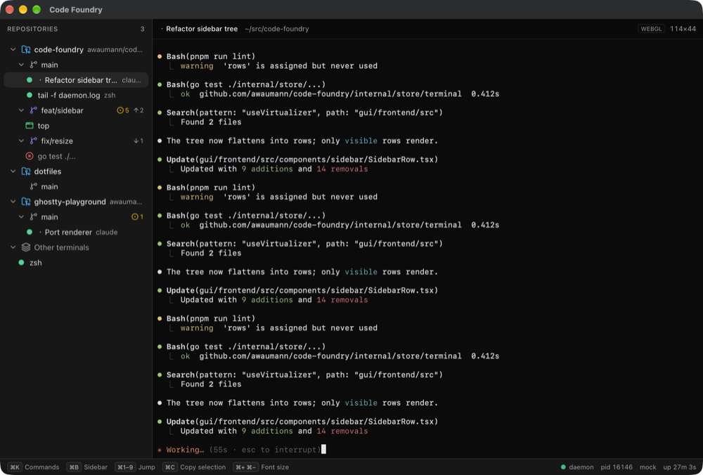
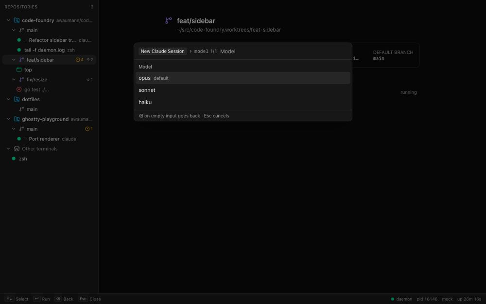
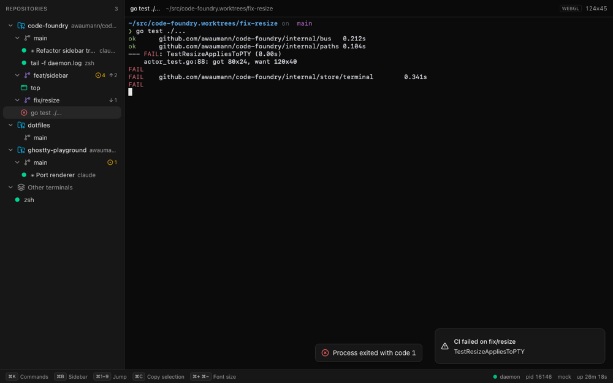

# Phase 1e: GUI shell

Status: done on branch, against the landed `terminal`/`repo`/`command`/`ui` contracts. On this
branch the daemon only serves `HealthService`, so the frontend was built and verified
against a mock daemon (`gui/frontend/mock/`). The real daemon was used to check graceful
degradation (Health in the footer, other services retrying).

Verified: `make check` green (144 unit tests), `pnpm run e2e` 20/20 (WebKit + Chromium,
~22s, 60/60 over three repeats), and the UI checked visually in the real Wails window
(`wails3 dev`) and in headless WebKit.



## How to run

| What | Command |
|---|---|
| Mock daemon | `make gui-mock` or `cd gui/frontend && pnpm run mock` (port 7788, token `dev-mock-token`; `MOCK_PORT`, `MOCK_TOKEN` override) |
| Frontend against the mock (browser) | `pnpm run dev:mock`, then open http://127.0.0.1:9245 (reads `.env.mock`) |
| Any dev frontend against any daemon | `http://127.0.0.1:9245/?daemon=<baseUrl>&token=<token>` (`pnpm run mock` prints this URL) |
| Wails window against the mock | `cd gui && VITE_DAEMON_URL=http://127.0.0.1:7788 VITE_DAEMON_TOKEN=dev-mock-token wails3 dev` |
| Wails window against the real daemon | `make gui-dev` (unchanged from Phase 0) |
| Push an intent | `pnpm run mock:emit focus-terminal t-top`, `… focus-repo repo-cf [path]`, `… palette [query]`, `… notify warning "Title" "body"` |
| e2e | `make gui-e2e` or `pnpm run e2e`. First run `pnpm exec playwright install webkit chromium`. |
| Test the WebGL fallback in WKWebView | add `VITE_SIMULATE_WEBGL_LOSS_MS=6000` to the `wails3 dev` line; the terminal header badge (dev builds only) flips `WEBGL` to `DOM` |

The endpoint override (query param first, then `VITE_DAEMON_URL`/`VITE_DAEMON_TOKEN`) only
exists in dev builds (`import.meta.env.DEV`). Production builds always ask the Wails host.

Mock control endpoints for tests (no auth): `GET /__mock/invocations`, `/__mock/writes`,
`/__mock/resizes`, and `POST /__mock/reset`.

**e2e is not part of `make check`.** It's reliable and fast enough (about 22s), but it needs
Playwright browser binaries that CI doesn't install. To add it to CI, add
`pnpm exec playwright install --with-deps webkit chromium` to the workflow, then make
`gui-e2e` a dependency of `frontend-check`.

## Layout

```
src/api/        terminal.ts repo.ts command.ts ui.ts health.ts: Connect clients + view-model mapping
                stream.ts: runStream (reconnect/backoff/resync); endpoint.ts: DaemonConnection + dev override
src/stores/     terminals repos commands intents ui health: Zustand slices; context.ts derives UiContext
src/keys/       chord.ts (parse/normalize/format), bindings.ts (global key handler), hints.ts (footer)
src/terminal/   renderer.ts (TerminalRenderer), xterm.ts (XtermRenderer), attach.ts (AttachController), theme.ts
src/palette/    args.ts: pure arg-prompt state machine
src/lib/tree.ts sidebar placement + flattening
src/components/ sidebar/ terminal/ palette/ footer/ Dashboard.tsx ui/ (shadcn: command, dialog, sonner, button)
mock/           server.ts world.ts screens.ts hub.ts emit.ts
e2e/            app.spec.ts fixtures.ts
```

## Decisions

### State shape

* **One slice per service.** `terminals` and `repos` are `{ byId, order, loaded, stream, streamError }`.
  `commands` is `{ commands, contextKey, loading, error }`, `intents` holds only stream status,
  and `ui` holds the selection, focus region, palette, collapse state, and persisted settings
  (sidebar width/visibility, font size, collapsed nodes; localStorage `code-foundry.ui`).
* **Reducers are pure and identity-preserving.** `applyTerminalEvent`, `replaceTerminals`,
  `applyRepoEvent` and `replaceRepos` return the same object for no-op updates. An unchanged
  terminal keeps its identity, so a row re-renders only when its own data changes.
* **The sidebar never subscribes to a whole slice.** The tree structure comes from
  `useShallow` selectors that produce one string per repo (id plus worktree paths) and one per
  terminal (id, cwd, `labels.worktree`). Title, state and git-status updates don't rebuild
  the tree. Each row subscribes to its own item. The list is virtualized (`@tanstack/react-virtual`,
  fixed 26px rows).
* **`Selection` is the only source for `UiContext`.** `deriveContext()` (pure, table-tested)
  maps it as follows:
  * Terminal: `active_terminal_id`, plus repo/worktree from the same placement the sidebar
    uses, plus `active_session_id` from `labels.session`, with `active_view="terminal"`.
  * Worktree: `active_view="worktree"`.
  * Repo: its main worktree, with `active_view="repo"`.
  * None: `active_view="dashboard"`.
* **Command list sync.** Commands are re-listed when the derived context or the selected
  terminal's state changes (60ms debounce), when the palette opens, and after every Invoke.
  An identical result keeps the old array, so an open palette doesn't re-render.

### Streams

* `runStream` gives each attempt its own `AbortController`, chained to a stop controller.
  Reconnects use exponential backoff (250ms doubling to 10s, ±20% jitter), which resets
  after a successful resync or first event. A stream that ends cleanly also reconnects,
  unless `shouldReconnectOnEnd` says otherwise. `NotFound` and `InvalidArgument` are
  permanent. A stopped runner never reports status again. Without that rule, the
  StrictMode double mount left the intents stream showing "stopped".
* **Watch resync**: every (re)connect starts `Watch` and calls `List` at the same time.
  `Watch` events are buffered until `List` returns, then replayed, so a stale list never
  overwrites newer events.
* The cached endpoint is dropped only on `Unavailable`, `Unauthenticated` or `Unknown`, which
  covers a daemon restart with a new port or token. It is kept on `Unimplemented` and on
  HTTP 404.

### Attach lifecycle (`AttachController`, one per `TerminalPane`)

* A single `XtermRenderer` lives as long as the pane. It is not recreated per terminal,
  because WebKit caps live WebGL contexts.
* `attach(id)` bumps a generation counter, aborts the previous stream, `reset()`s, and opens
  `Attach`. Late events from the old stream are dropped by generation.
* `Snapshot`: `reset()`, then `resize(snapshot.cols, rows)`, then `write(data)`, then `fit()`
  to the container. If the fitted size differs from the PTY's, it sends one `Resize`
  immediately.
* `Output`: `write`. `Resized`: `renderer.resize` (programmatic resizes never fire
  `onResize`, so there is no echo). `Exited`: an overlay shows the exit code, input is
  ignored, and the stream is not reopened when it ends.
* Input goes through an ordered queue: one `Write` in flight, later bytes coalesced. Over
  HTTP/1.1, parallel unary requests can reorder keystrokes.
* Container size: a `ResizeObserver` triggers `fit()` on the next animation frame, and the
  resulting `onResize` events are debounced (80ms) into a single `Resize`.
* A stream error before `Exited` shows "Reconnecting…" and re-attaches with backoff. The new
  snapshot resets the screen.
* Clipboard: cmd+c with a selection copies through the Clipboard API, falling back to
  `execCommand("copy")`. cmd+v is left to the browser, whose native `paste` event xterm turns
  into input (bracketed when enabled). Links open on cmd+click. Wheel scrollback is xterm's.
* Font: `"JetBrains Mono", "SF Mono", ui-monospace, SFMono-Regular, Menlo, …`. No web font, so
  cell metrics are known at open time. Size is a persisted setting (default 13).

### Key precedence (`src/keys/bindings.ts`, window `keydown` in the capture phase)

1. **Global view actions always win, even inside xterm**: cmd+k / cmd+shift+p (palette),
   cmd+b (sidebar), cmd+1..9 (jump to the Nth terminal in sidebar order, ignoring collapse),
   and cmd+= / cmd+- / cmd+0 (font size). They are handled before xterm sees the event, and
   `XtermRenderer`'s custom key handler also returns false for them.
2. **A focused terminal consumes everything else**, so the PTY receives it.
3. **A focused text field (the palette input) consumes everything else.**
4. **Command keybindings** from `CommandService.List` (available commands only, for the
   current context). A command with required args opens the palette in arg mode. Otherwise
   it calls Invoke directly.

* Chords are matched on `KeyboardEvent.code` for letters, digits and punctuation, so
  alt+p (which types π) and shift+1 (which types !) still match. The canonical form is
  `cmd+ctrl+alt+shift+<key>`. Aliases are accepted (meta/command/⌘, control/⌃, opt/option/⌥).

### Palette

* Uses cmdk inside a Radix dialog. Fuzzy matching covers `name`, `title` and `category`;
  descriptions are excluded because they made "create worktree" match "New Claude
  Session". Items are grouped by category with the first keybinding shown, and only
  `available` commands are listed.
* The context is snapshotted when the palette opens, and Invoke always sends that snapshot.
* **Arg prompts**: only required args are prompted; optional args take the daemon's default.
  The input type depends on the arg:
  * enum: a filterable list, with the default highlighted.
  * bool: Yes/No.
  * int: validated client-side.
  * string or path: free text, passed through unchanged (`~` is expanded daemon-side).

  Backspace on an empty input goes back one step. Esc closes. cmdk is remounted per step, so
  its highlight starts on a valid item.
* **Pressing Enter before the list for this context has arrived is deferred**. It runs the
  highlighted item once the list is fresh. Without this, a fast "click worktree, cmd+k,
  type, Enter" did nothing in Chromium. cmdk doesn't report automatic highlights through
  `onValueChange`, so the deferred Enter reads `[cmdk-item][data-selected]` from the DOM.

### Theme

The page ships with `class="dark"` (no flash). It then follows the macOS appearance live
(`prefers-color-scheme`), and the xterm theme and sonner follow it too.

## Deviations from the brief

* **No `addon-canvas`.** xterm.js 6 removed the canvas renderer, and `@xterm/addon-canvas@0.7`
  requires `@xterm/xterm ^5`. The fallback is xterm's built-in DOM renderer: on WebGL
  context loss the WebGL addon is disposed and xterm repaints with DOM. This was verified
  in Playwright WebKit and Chromium (`WEBGL_lose_context`), and in the real WKWebView via
  `VITE_SIMULATE_WEBGL_LOSS_MS` (the header badge flipped to `DOM` and output kept
  rendering). We stay on xterm 6 because it is the maintained line, and 5.5 is from April
  2024. ARCHITECTURE.md §8 should say "fallback to the DOM renderer".
* **The global allowlist adds cmd+= / cmd+- / cmd+0** (font size) to the brief's
  cmd+k, cmd+shift+p, cmd+1..9 and cmd+b. These and the palette/sidebar/jump chords are
  GUI-local view actions, not registry commands: they change only what the window shows.
  If 1d wants them in the registry, the GUI can map a command name to the same function.
* **cmd+b semantics**: hiding the sidebar returns focus to the terminal; showing it focuses
  the tree. Pressing cmd+b twice is the keyboard path from the terminal to the sidebar.
* The Phase 0 `HealthPanel` was removed. Its pid/version/uptime now live in the footer
  (`DaemonStatus`, which has the same test coverage).

## What the daemon-side steps must do for the UI to work

**Terminal (1a)**

* The snapshot must be self-contained after a full reset (RIS). Re-emit everything that
  changes what xterm sends or how it parses, not just the grid:
  * alt screen (`?1049h`)
  * cursor position, cursor visibility (`?25`), and SGR state
  * bracketed paste (`?2004`), mouse modes (`?1000/1002/1003/1006`), and focus reporting (`?1004`)
  * application cursor keys (`?1h`) and keypad mode
  * scroll region

  Without these, paste and arrow keys break after attach.
* For `Snapshot.cols/rows`, the client resizes xterm to these before writing, so they must
  match the size the data was rendered at.
* An exited terminal's `Attach` should send `Snapshot` and then `Exited`, then end the
  stream. A live terminal's stream should send `Exited` when the process dies. The client
  doesn't reconnect after `Exited`. Ending the stream without `Exited` triggers a reconnect.
* Echoing `Resized` for the attached client's own `Resize` is fine (no-op). Sending it on
  every output is not.
* `Watch` may send current state on subscribe. That is idempotent with the client's
  List-then-Watch resync and recommended, since it also flushes response headers early.
* Accept a `Resize` immediately after `Attach`, possibly before the first `Output`.

**Labels (whoever creates terminals: 1a CLI / 2a sessions)**

* `labels.worktree` = the absolute worktree path, exactly equal to `Worktree.path`. This
  places the terminal under that worktree. Otherwise placement falls back to the longest
  worktree path that is a path-segment prefix of `cwd`, then to "Other terminals".
* `labels.session` = session id. It becomes `UiContext.active_session_id` when the terminal
  is selected.

**Commands / UI (1d)**

* `List` without `include_unavailable` returns only available commands (the GUI also filters
  on `available`). `Invoke` errors are shown as a toast with the Connect message, and
  `InvokeCommandResponse.message` is shown as a success toast when non-empty.
* Arg values arrive as strings: bool `"true"`/`"false"`, int as decimal, enum as the exact
  value, path unexpanded (expand `~` daemon-side). Optional args are never sent unless the
  palette prompted for them, so apply `default_value` server-side.
* Keybinding syntax, as parsed by `src/keys/chord.ts`:
  * modifiers `cmd`, `ctrl`, `alt` and `shift`, joined with `+`
  * keys: a letter or digit, `enter`, `escape`, `tab`, `space`, `backspace`, `delete`,
    `arrowup`/`up` and the other arrows, `f1`–`f12`, or punctuation (`,` `.` `/` `=` `-` `[` `]` `;` `'` `` ` ``)

  Don't bind the reserved global chords (cmd+k, cmd+shift+p, cmd+b, cmd+1..9, cmd+=, cmd+-,
  cmd+0). Command chords don't fire while a terminal has focus.
* A command that creates something and emits `FocusTerminal`/`FocusRepo` should publish the
  `Watch` update first. The GUI attaches to an id it hasn't listed yet, but `NotFound`
  shows an error overlay.
* `UiService.WatchIntents` keeps one stream per window. `Notify` levels map to info, warning
  and error toasts.

**All services**

* **Browsers use HTTP/1.1 against `http://127.0.0.1`**, because there is no h2c in
  WKWebView or Chrome. That caps the GUI at 6 concurrent connections per origin.
  The GUI already holds 4 long-lived streams (terminal Watch, repo Watch, WatchIntents,
  Attach), leaving 2 for unary calls. Adding SessionService.Watch and GhService.Watch in
  Phase 2 would exhaust the pool and stall Write and Resize. Options: a multiplexed
  "events" stream, folding new watches into existing ones, or serving a second loopback
  origin.
* Don't set `WriteTimeout` or `IdleTimeout` on the loopback server, because streams are
  long-lived. Phase 0's server doesn't set either, and its request logger keeps `Flush`.
* Unregistered services return HTTP 404, which the GUI shows as "Cannot list repositories:
  HTTP 404. Retrying…" and retries every 10s (seen against this branch's daemon).

## Gotchas

* **WebKit WebGL canvas**: xterm's `.xterm-link-layer` is a 2D canvas that comes first in
  the DOM, so the WebGL canvas is `.xterm-screen canvas:not(.xterm-link-layer)`. Context
  loss in WebKit is asynchronous (the test takes about 4s). The WebGL renderer was active
  in the real WKWebView, in headless WebKit, and in Chromium.
* **Clipboard in WKWebView**: the Wails default app menu includes Edit (Copy/Paste), so
  cmd+c and cmd+v reach the webview as native copy/paste events. cmd+v and selection copy
  could not be exercised interactively: this session's osascript lacks Accessibility
  permission, so there were no synthetic keystrokes in the real window. The window was
  driven with UiService intents instead (FocusTerminal, OpenPalette). In Playwright
  (WebKit + Chromium), typed input reaches the PTY in order.
* `wails://` is not a secure context in every WebKit build, so `navigator.clipboard` may be
  missing. `copyText` falls back to `execCommand("copy")`.
* **cmdk**: automatic highlight changes aren't reported through `onValueChange`, and a
  controlled `value` doesn't re-highlight when items arrive after the search changed. Hence
  the per-step remount and the deferred Enter.
* **The production bundle is about 1 MB** (xterm plus the WebGL addon), and Vite warns about
  the chunk size. That's harmless for a local webview, so it was not split.
* **pnpm 12 `allowBuilds: { esbuild: false }`** is needed. Without it, `pnpm install
  --frozen-lockfile` fails with `ERR_PNPM_IGNORED_BUILDS` once tsx brings in esbuild.
  esbuild's binary comes as an optional platform package, so its postinstall isn't needed.
  The pnpm ENOEXEC issue noted in Phase 0 is gone: the global pnpm is now a native binary,
  and `wails3 dev` ran without a wrapper.
* Playwright `webServer` commands run without `node_modules/.bin` on PATH when launched as
  `playwright test` directly, so the config calls `./node_modules/.bin/tsx` and `vite`.
* Row keys use `::`, not NUL, as the repo/path separator. CSS attribute selectors can't
  match a NUL character.

## Screenshots

* `phase1e/wails-terminal.png`: the real Wails window (WKWebView, WebGL) against the mock:
  sidebar tree with worktree git status, a Claude-like session attached, and footer hints
  plus daemon status.
* `phase1e/palette-args.png`: the palette in worktree context, prompting for
  `session.new`'s required `model` enum.
* `phase1e/exited-notify.png`: an exited terminal with its exit overlay, and a `Notify`
  intent toast.



