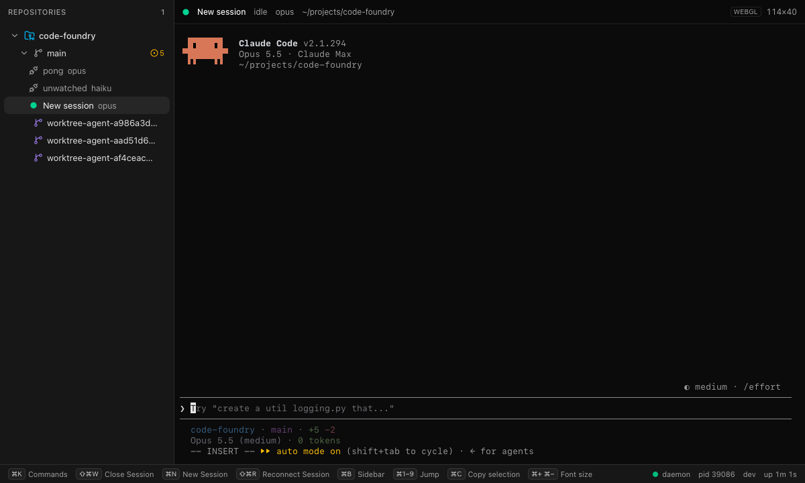
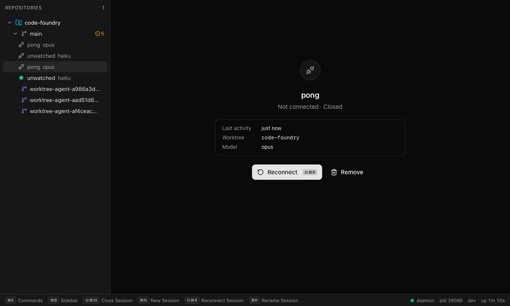
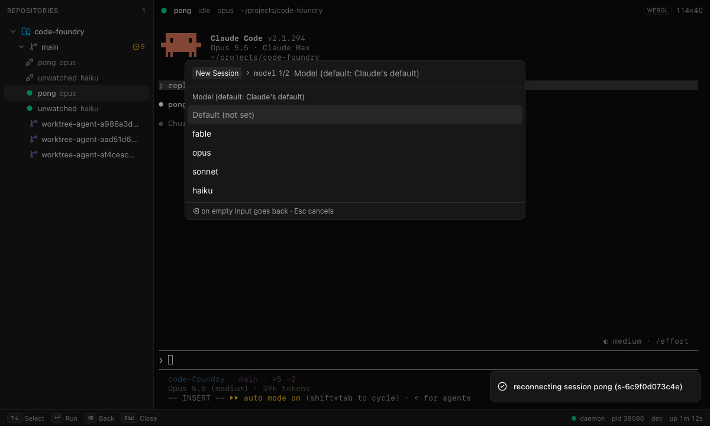

# Phase 2 integration

Status: done on `main`. `make check` is green and `make gui-e2e` passes 44/44, with none
skipped (the FocusSession test now runs). The opt-in live e2e (`e2e/live.spec.ts`)
passed against a real daemon and Claude Code 2.1.294 in WebKit. A full run takes about
14 s and spends two short turns.

## What was wired

| Commit | Change |
|---|---|
| `feat(api): serve session events on EventService` | `EventsDeps.Session`, plus a `sessionSource` that reuses `sessionEventToProto` from `api/session.go`. Snapshot order is repo, terminal, session, gh, then ui. `daemon.go` passes the store. In `events_test.go`, a session snapshot and a live update are added to the order test, and the session filter row now expects `session.snapshot(0)` (a gh-only row was added too). |
| `feat(gui): map FocusSession intents with the generated type` | Typed `case "focusSession"` in `src/api/ui.ts`. Removed the by-name fallback, the `hasFocusSession*` feature detection (app, mock, e2e) and the FocusTerminal stand-in in the mock. |
| `feat(session): acknowledge finished turns while the session is viewed` | `terminal.ObserveEvent.Attached *int`, plus the runner rule below and its tests. |
| `feat(command): session keybindings; …` | Chords for session.rename, reconnect and close. ui.palette.open loses cmd+k. Adds a registry-wide collision test. |
| `feat(session): expose the detector's status reason` | Additive `Session.status_reason = 18`. `session list` shows it. |
| `test(gui): opt-in live e2e …` | `e2e/live.spec.ts`, `playwright.live.config.ts`, `pnpm run e2e:live`, and the screenshots below. |

## Acknowledge rule

The detector reports `NEEDS_ATTENTION "finished"` when Claude produced work after the
last acknowledgement. Before this pass, only typed input acknowledged. The rule now is:

* **When a viewer attaches** to the session's terminal (TerminalService.Attach), the
  runner calls the detector's optional `Acknowledge()`.
* **While at least one viewer is attached**, the runner also acknowledges after every
  output chunk and every transcript line it feeds to the detector.
  * The transcript part extends the brief. The `assistant` turn-end record arrives about
    120 ms after the last output chunk and counts as new work. Without it, a viewed turn
    would flash "finished" until Claude's next redraw.
* **Detaching never acknowledges.** Output that arrives after the last viewer leaves stays
  unseen.
* **Dialog attention is unaffected** (permission, question, plan, trust). It lasts until
  the dialog is gone from the screen.

Mechanism:

* The terminal actor calls the observer with `ObserveEvent{Attached: &n}` after each
  attach, detach, or slow-subscriber drop. It is ordered with Output on the actor, so
  "Output while n > 0" means a viewer received that output.
* It is not delivered after Exited, so Exited stays the last event.
* The observer stays on the actor only. Attach subscribers are not involved in status.
* `detector.go` documents `Acknowledge()` as optional, like `Input`. `daemon/detector.go`
  asserts the adapter still exposes both.

Tests:

* `TestAcknowledgeWhileViewed` (session) is a table of attach, detach, output and
  transcript sequences against the fake terminal store. It was checked by mutation:
  removing the output ack fails every row with output while viewed.
* `TestFinishedClearsWhenViewed` covers the CLI-visible behaviour: finished while unviewed,
  idle once attached, finished again after the viewer leaves.
* `TestObserverSeesAttachCount` (terminal, real PTY) checks counts 1, 2, 1 and that nothing
  is reported after exit.
* The fake terminal store now serializes observer calls, so an attach or detach
  notification cannot be overtaken by later output.

What you see:

* `session list` shows `connected  needs_attention  finished` while nobody looks. It
  switches to `idle  at prompt` once a GUI shows the session.
* The REASON column is the status reason for live sessions and the disconnect reason for
  disconnected ones.

## Keybindings

Session commands (registry, `internal/command/commands_session.go`):

| Command | Chord |
|---|---|
| session.new | cmd+n |
| session.rename | cmd+r (the GUI starts the inline rename) |
| session.reconnect | cmd+shift+r |
| session.close | cmd+shift+w (never cmd+w: the Wails menu closes the window) |
| terminal.new | cmd+t |
| ui.palette.open | none (it was cmd+k) |

Reserved chords: no command may bind these. `TestKeybindingsAreUniqueAndNotReserved`
hardcodes the list and points at the frontend sources.

| Source | Chords |
|---|---|
| GUI view actions (`src/keys/bindings.ts` `viewActions`) | cmd+k, cmd+shift+p, cmd+b, cmd+shift+a, cmd+1..9, cmd+=, cmd+-, cmd+0 |
| Editing chords (`src/keys/chord.ts` `editingChords`) | cmd+c, cmd+v, cmd+x, cmd+a, cmd+z, cmd+shift+z |
| App menu | cmd+w, cmd+q |

The only collision found was ui.palette.open on cmd+k. In the GUI, cmd+k is a view action
that opens the palette locally, so the command's binding could never fire. It was removed
on the command side. No chord is bound twice.

## Live verification (2026-10-08, WebKit, real daemon)

Recipe (also in the spec header):

```
export CODE_FOUNDRY_HOME=$(mktemp -d)
make build && ./bin/code-foundry daemon --dev &
./bin/code-foundry repo register --path "$PWD"
cd gui/frontend
VITE_DAEMON_URL=http://127.0.0.1:$(cat $CODE_FOUNDRY_HOME/daemon.port) \
VITE_DAEMON_TOKEN=$(cat $CODE_FOUNDRY_HOME/daemon.token) \
WAILS_VITE_PORT=9247 pnpm run dev --host 127.0.0.1 &
LIVE_DAEMON=1 LIVE_APP_URL=http://127.0.0.1:9247 LIVE_SHOTS=../../docs/notes/phase2-integration pnpm run e2e:live
```

| Step | Observed |
|---|---|
| a. `session new --worktree … --model opus` | The row appears under `main` with an emerald idle badge before it is selected. CONNECTED 485 ms after spawn ("title set"). |
| b. Select the row | Attach goes live. The banner, `❯ Try "…"` between rules and `-- INSERT --` render. `data-terminal-id` equals the session's `terminal_id`. |
| c. Type "reply with the single word pong" + Enter | The badge goes busy, then idle. Sampled every 50 ms, the badge never showed attention. `⏺ pong` is on screen. `session list --json` reports `SESSION_STATUS_IDLE`. The title stays "Code Foundry". Auto-named `pong`. |
| c′. Unwatched turn (spec addition) | The page is navigated away. `session new --model haiku --name unwatched --prompt "reply with the single word ping"` then shows `unwatched  connected  needs_attention  finished` in `session list`. Reloading the GUI shows the amber badge and the title "Code Foundry (1)". Selecting the session turns the badge idle, and the CLI shows `SESSION_STATUS_IDLE`. |
| d. `session close --id <id>` | The pane flips to "Not connected · Closed", the row shows the unplug icon, and the close takes 0.73 s. Reconnect spawns `claude --resume <id> --model opus` (CONNECTED in 542 ms). The terminal shows `❯ reply with the single word pong` and `⏺ pong`, and the badge settles idle. |
| e. cmd+n from the focused terminal | The palette opens in args mode on "New Session › model 1/2" with Default (not set), fable, opus, sonnet and haiku. Picking sonnet moves to effort (low … max). Escape cancels and nothing is created. |
| f. `session focus --id <id>` | Prints `delivered=1`. The row becomes selected and its terminal attaches. |

Afterwards the sessions were closed, and the daemon and Vite were stopped. The project
keys in `~/.claude.json` are unchanged (14), because the worktree was already trusted.
The 13 transcripts these runs wrote under
`~/.claude/projects/-Users-alex-projects-code-foundry/` were deleted.





## What did not work at first, and gotchas

* **`session list` could not show "finished".** The status reason was never on the wire
  (Session had no field for it), so `status_reason` (18, additive) was added.
* **Another viewer silently acknowledged the "unwatched" turn.** The first two live runs
  failed step c′ with `idle "at prompt"`.
  * Debug logging showed a TerminalService.Attach on the new session's terminal 18 ms
    after spawn, from origin `127.0.0.1:9246`.
  * The cause was the host app's preview tab, which had opened the Vite dev server on
    9246. It is a full GUI client: it follows the FocusSession that `session.new` emits,
    so it attached and correctly acknowledged.
  * The final runs used port 9247. The spec also navigates its own page away before
    creating the unwatched session.
  * Takeaway: any GUI window that has the session selected counts as looking at it,
    even if it is hidden or behind other windows. Attach knows nothing about visibility.
* **xterm.js auto-replies count as user input.** An attached xterm answers Claude's
  terminal queries through TerminalService.Write: DA1 `\e[?1;2c`, DECRQM
  `\e[?2026;2$y`, and focus reports `\e[O`.
  * The session store forwards every Write to the detector's `Input`, so these replies
    also acknowledge.
  * That matches the rule (only an attached viewer sends them), but it means "Input" is
    not "the user typed". A focus-out report arrives when the window loses focus.
* **WebKit's "Desktop Safari" device renders at 2x**, which made the screenshots
  2400×1440. The live config sets `deviceScaleFactor: 1`.
* **The cmd+n palette was captured half-transparent** during its open animation. The spec
  waits 400 ms before that shot.
* **`pkill -f "vite --host"` does not match** the Vite process, whose argv is
  `node …/vite/bin/vite.js --host`. A stale server kept port 9246 busy once.
* `docs/notes/phase1e-gui.md` still says command chords don't fire while a terminal has
  focus. 2c changed that (cmd chords bound to commands are yielded).

## Open

* Phase 2 memory gate: ten idle sessions with `footprint`, recorded in `docs/perf.md`.
  Not done in this pass.
* The GUI does not show `status_reason` yet. The badge tooltip or session header could
  say "permission: Do you want to proceed?".
* Viewer is approximated by "has an Attach subscriber". A minimized or occluded Wails
  window keeps acknowledging. If that matters, the GUI could detach when the window is
  hidden (`visibilitychange`). That is a frontend change.
