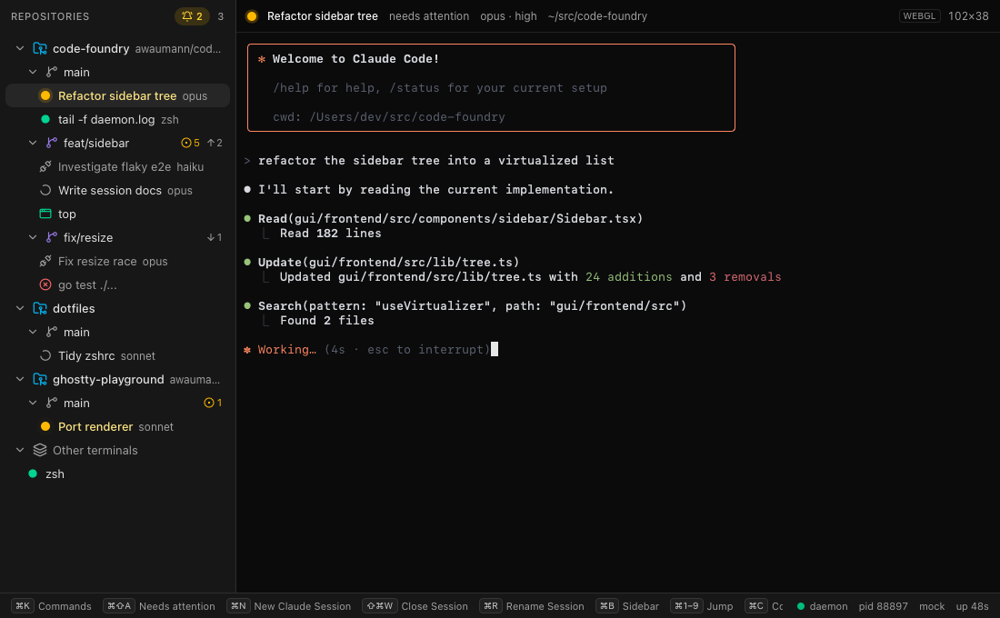
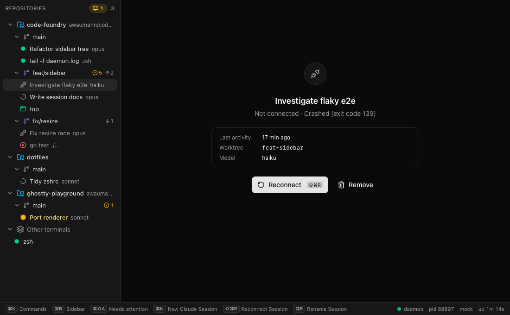
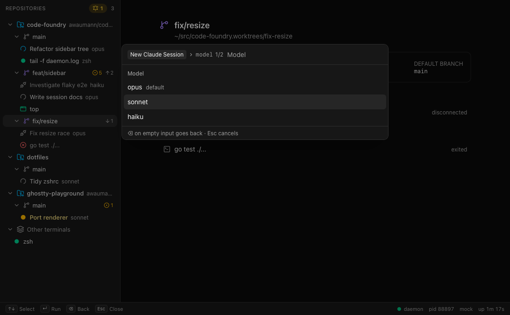

# Phase 2c: EventService and the session GUI

Status: done on branch `worktree-agent-a986a3df578d6f5d9`, built against the landed
`events`/`session`/`ui` contracts. The session store (2a) is not on this branch, so session
behaviour was built and verified against the mock daemon. The real daemon on this branch
serves EventService (repo, terminal, gh and UI sources) but not SessionService, which was
used to check that the GUI degrades cleanly.

Verified:

* `make check` green.
* `make gui-e2e`: 44 tests (22 per browser, WebKit and Chromium). 42 pass and 2 are
  skipped: the FocusSession test, which turns on by itself after merge.
* The UI was checked in headless WebKit against the mock and in the real Wails window.
  * Wails against the mock: the native title read "Code Foundry (2)" after a session was
    flipped to needs-attention.
  * `make gui-dev` against this branch's real daemon (isolated `CODE_FOUNDRY_HOME`):
    repos, worktrees and the terminal attach work, the sidebar shows "Sessions: service
    unavailable", and the footer has no "syncing" warning.



## EventService (Go, `internal/api/events.go`)

* `api.NewEvents(api.EventsDeps{Bus, Repo, Terminal, Gh, Done})`. A nil store leaves that
  source out of the stream. The route is registered in `internal/daemon/daemon.go`.
* **Sources are adapters.** Each one implements `eventSource`:

  ```go
  kind() v1.EventSource
  subscribe(ctx) <-chan *v1.Event  // live events; a nil event means "I dropped, resend my snapshot"
  snapshot(ctx) []*v1.Event
  ```

  A new set of adapters is built for every stream, so an adapter can hold per-client state.
  `sources()` lists them in the order events.proto promises: repo, terminal, session (the
  merge slot), gh, then ui.
* **Watch** works in this order:
  1. Subscribes every requested source. Each source's bus subscription is its own bounded
     buffer.
  2. Sends the snapshots in order.
  3. If no snapshot sent anything, flushes the response headers with `Send(nil)`.
  4. Merges the live channels.

  When one source drops events, only that source's snapshot is resent, so other sources
  are not affected. `sources` in the request filters the stream (empty means all).
  EVENT_SOURCE_SESSION yields nothing until the merge.
* **Mapping is shared, not copied.**
  * repo uses `eventToProto` and `reposToProto`.
  * terminal uses `terminalEventToProto`, factored out of `Terminal.Watch`.
  * gh uses `ghPullRequestsEvent` and `ghViewerEvent`, factored out of `Gh.Watch`.
  * ui forwards `command.IntentEvent.Intent` unchanged.

  The per-service handlers behave exactly as before.
* **Buffer sizes** match the per-service handlers: repo 256 (`watchBuffer`), terminal 256
  per topic (as `Manager.Watch`), gh 64, ui 32.
* **Terminal snapshot.** terminal.proto has no snapshot message, so the terminal snapshot is
  one `updated` per terminal plus a `removed_id` for every id this client was told about
  that no longer exists. The adapter tracks the ids each client knows. Without the removals,
  a resync after drops would leave ghost rows.
* **gh snapshot.** gh events only tell the client to re-read, so the snapshot is one
  `viewer_updated` plus one `pull_requests_updated` per cached slug, sorted.
* **UI intents** have no snapshot. Intents dropped for a slow client are lost, as with
  `WatchIntents`. EventService subscribers count toward `UiService.Emit`'s `delivered`.
* Tests (`events_test.go`, using the repotest, terminaltest and ghtest fakes) cover:
  * snapshot order, then live events from every source
  * source filtering (table test)
  * resync of only the source that dropped, with the stream staying live
  * `Done` ending the stream cleanly
  * terminal snapshot retraction (table test)

### Merge steps: adding the session source (2a)

1. In `internal/api/events.go`, add `Session session.Store` to `EventsDeps`. Use whatever
   type `api/session.go` takes.
2. Add an adapter next to `repoSource`. `sessionEventToProto` and `sessionsToProto` are
   placeholders for whatever mapping `api/session.go` already has; reuse it, don't copy it.
   ```go
   type sessionSource struct{ store session.Store; bus *bus.Bus }

   func (sessionSource) kind() v1.EventSource { return v1.EventSource_EVENT_SOURCE_SESSION }

   func (s sessionSource) subscribe(ctx context.Context) <-chan *v1.Event {
       return fanIn(ctx, newTap(s.bus, watchBuffer, func(ev session.Event) *v1.Event {
           if m := sessionEventToProto(ev); m != nil {
               return &v1.Event{Event: &v1.Event_Session{Session: m}}
           }
           return nil
       }))
   }

   func (s sessionSource) snapshot(context.Context) []*v1.Event {
       return []*v1.Event{{Event: &v1.Event_Session{Session: &v1.SessionEvent{Event: &v1.SessionEvent_Snapshot{
           Snapshot: &v1.SessionSnapshot{Sessions: sessionsToProto(s.store.Snapshot().Sessions)},
       }}}}}
   }
   ```
   If the store publishes several bus types, pass one `newTap` per type to `fanIn`, as
   `terminalSource` does.
3. In `sources()`, replace the `// Session (Phase 2a) goes here` comment with
   `if d.Session != nil { out = append(out, sessionSource{store: d.Session, bus: d.Bus}) }`.
4. In `daemon.go`, add `Session: <the session store>` to the `api.EventsDeps{...}` literal.
5. In `events_test.go`:
   * add a `session.updated` case to `TestEventsSnapshotOrderThenLive`, after terminal and
     before gh
   * change the "session (not served yet)" row of `TestEventsSourceFilter` to expect a
     snapshot
6. After `make gen` with `FocusSession` in ui.proto:
   * replace the `default:` fallback in `gui/frontend/src/api/ui.ts` with a typed
     `case "focusSession"` (marked `TODO(phase2a merge)`)
   * the vitest `it.runIf(hasFocusSessionIntent)` case and the Playwright "FocusSession
     intent selects the session" test enable themselves
   * the mock emits real FocusSession intents from then on

## Frontend: one events stream

* `src/api/events.ts`: `watchEvents()` opens `EventService.Watch` with all sources and maps
  each `Event` to a tagged `EventView` (`{ source: "repo" | "terminal" | "session" | "gh" | "ui", event }`).
  Generated types stay in `src/api/`.
* `src/stores/events.ts`: `startEventSync()` is the only long-lived sync.
  * **Dispatch is a registry.** `handlers` maps each source to a slice reducer: repo goes
    to `applyRepoEvent`, terminal to `applyTerminalEvent`, session to `applySessionEvent`,
    ui to `applyIntent`, and gh is dropped (no slice until Phase 3). Adding a source means
    adding one entry.
  * **Reconnect reconciliation.** On every (re)connect, `onConnect` runs the repo,
    terminal and session `List` calls alongside the stream, as before. `runStream` buffers
    events until they resolve. This still matters because the terminal part of the stream
    snapshot cannot express removals since the last connection.
  * **Session List failures never fail the resync.**
    * HTTP 404 / Unimplemented / NotFound: the sessions slice becomes `unavailable` (the
      sidebar footer shows "Sessions: service unavailable") and is retried every 10s.
    * Other errors: recorded, and the stream carries on.
  * **Selection promotion.** After terminal or session events, a selection that points at
    a session's terminal (for example, a FocusTerminal that raced the session event) is
    converted to the session.
* The per-slice `stream`/`streamError` fields and `startTerminalSync`, `startRepoSync` and
  `startIntentWatch` are gone. `useEventsStore` holds the one stream status, and the footer
  says "syncing events…" while it is not open.
* `watchTerminals`, `watchRepos` and `watchIntents` were removed from `src/api/`. The
  per-service Watch RPCs remain in the daemon for the CLI and tests.

### Connection budget (HTTP/1.1, 6 per origin)

| | Before (1e) | After (2c) |
|---|---|---|
| Long-lived | terminal Watch, repo Watch, WatchIntents, Attach (4) | EventService.Watch, Attach (2) |
| Free for unary (Write, Resize, List, Invoke, Ping) | 2 | 4 |

Session and gh events add nothing, because they ride the same stream. Asserted in e2e
("the whole app runs on one events stream plus one Attach"):

* Client side, from Playwright network entries: exactly one `EventService/Watch` request,
  zero per-service Watch requests, and one open Attach after three terminal switches.
* Server side: the mock's `GET /__mock/streams` reports
  `{ "EventService/Watch": 1, "TerminalService/Attach": 1 }`.

## Sessions in the UI

### Sidebar

* Under each worktree, session rows come first, then plain terminals.
* A session is placed by `worktree_path`: exact match first, then the longest containing
  worktree. Sessions whose worktree is gone go to the "Other" group.
* A terminal is hidden when it belongs to a *known* session, either through
  `labels.session` or as some session's `terminal_id`. If SessionService is unavailable,
  session-labelled terminals show as plain terminals, so nothing disappears.
* Badges (`SessionStatusIcon`, `lib/session.ts`). Lifecycle state wins over activity
  status:
  * starting and closing: muted spinner
  * busy: sky spinner
  * idle: emerald dot
  * needs-attention: amber dot with a slow ping and an amber, medium-weight name
  * disconnected: muted name with the lucide `Unplug` icon
* Worktree rows show a "+" on hover, which selects the worktree and opens the palette on
  `session.new`.
* The header shows an amber count badge for needs-attention sessions. Clicking it is the
  same as cmd+shift+a.

### Content pane

* `Content` in `App.tsx` renders exactly one thing:
  * `TerminalPane` when the session has a `terminal_id`
  * `SessionDisconnected` when it doesn't
* `TerminalPane` stays mounted across terminal, session and reconnect switches, so the
  renderer (one WebGL context) is reused. When `terminal_id` changes, the existing
  `[terminalId]` effect re-attaches.
* Session header: badge, name, status word, model · effort, worktree path.
* STARTING and CLOSING show a thin indeterminate bar plus a "starting…" / "closing…" pill
  over the live terminal.
* "Not connected" panel:
  * the reason from `disconnect_reason`: "Closed", "Claude exited", "Claude exited with
    code N", or "Crashed (exit code N)"
  * last activity as relative time, refreshed every 30s
  * worktree and model
  * a primary **Reconnect** button (`session.reconnect`), autofocused so Enter works, with
    its chord shown on the button
  * a ghost **Remove** button (`session.remove`)

### Actions are registry commands

`stores/sessionActions.ts` invokes `session.reconnect`, `session.remove`, `session.rename`
and `session.new` through `CommandService.Invoke`, with an explicit session context
(`getUiContext({kind:"session", id})`). The GUI never calls SessionService mutations
directly. It only calls `SessionService.List`, for reconciliation.

### UiContext for a session

`active_session_id`, `active_terminal_id` (the attached terminal, or empty), the
repo/worktree from placement, and `active_view = "session"`.

### New session

* `cmd+n` is session.new's registry keybinding. It opens the palette in arg mode with the
  worktree from context. The sidebar "+" does the same for a specific worktree.
* **Palette rule change:** enum args are prompted even when optional. Model and effort come
  from `ArgSpec.enum_values` with `default_value` highlighted, and nothing is hardcoded.
* An optional enum without a default gets a "Default (not set)" choice, which omits the
  arg so the daemon applies its default.
* A pre-selected command with nothing to prompt runs straight away.

### Needs attention

* The window title is "Code Foundry (N)". It is set on `document.title`, and also through
  `Window.SetTitle` inside Wails, because Wails does not follow document.title. Wails is
  detected via `_wails.environment` or `webkit.messageHandlers.external`.
* `cmd+shift+a` is a global view action. It cycles through needs-attention sessions in
  sidebar order, wrapping around, and skips disconnected sessions.
* `FocusSession` selects the session and focuses its terminal. `FocusTerminal` on a
  session's terminal does the same.

### Rename

* Double-click a session row, or press F2: on the cursor row in the tree, or on the
  selected session elsewhere.
* session.rename's own chord (cmd+r in the mock) starts the inline edit instead of the
  palette prompt, via a small `commandPresenters` registry in `keys/bindings.ts`.
* Enter or blur commits via `session.rename`. Escape cancels. Focus returns to where it
  was.

### Footer hints

* With a session selected, `session.*` commands rank first.
* In terminal focus, the hints now include cmd chords the terminal yields (see below).
* Commands bound to a view-action chord (e.g. the registry's `ui.palette.open` on cmd+k)
  are no longer listed twice.
* F2 is listed only when session.rename has no chord of its own.

### Other

* `cmd+1..9` now counts sessions and terminals in sidebar order.
* The dashboard's worktree overview lists sessions above terminals.

## Decisions and deviations

* **cmd chords bound to commands fire from a focused terminal.** Phase 1e sent every
  non-global chord to the PTY. Sessions are terminals, so session.close, rename and
  reconnect could otherwise never be used from the main view. macOS terminals never send
  cmd chords to the PTY.
  * Excluded: cmd+c, cmd+v, cmd+x, cmd+a, cmd+z and cmd+shift+z.
  * Non-cmd chords such as ctrl+l still go to the PTY.
  * Implemented in `terminalYieldable` (`keys/chord.ts`) and `terminalYields` (bindings).
* **Optional enum args are prompted** (see New session). This applies to every command, so
  ui.notify's `level` is now prompted too, at the cost of one Enter on the default.
* **Stale command list on a fast chord.** If a modifier chord is unbound and the command
  list is for an older context, the list is refreshed and the chord looked up again. This
  covers clicking a worktree and pressing cmd+n immediately, which raced the 60ms-debounced
  re-list.
* **The FocusSession e2e test is a feature-detected skip,** not a hard failure. The mock
  can't encode an intent that the generated schema lacks.
* **No proto changes.** One additive change would help (see below), but none is needed.
* **The terminal snapshot has no message of its own.** That is handled by per-client id
  tracking in the adapter, instead of an additive `TerminalSnapshot` in terminal.proto.
  Suggested for a later additive change: `TerminalEvent.snapshot` (`repeated Terminal`).

## What 2a must guarantee

* **`terminal_id` and state change in the same update.**
  * DISCONNECTED must arrive with `terminal_id == ""` in the same `SessionEvent.updated`.
  * Reconnect must publish `terminal_id = <new id>` together with STARTING (or later).
  * The GUI decides "terminal or panel" from `terminal_id` alone. A DISCONNECTED session
    that still carries a stale terminal id would keep showing the dead terminal.
* **Event ordering.**
  * Publish the session's terminal (`TerminalUpdated`) before, or in the same tick as, the
    session update that references it. The GUI tolerates the other order, because Attach
    works by id, but its sidebar placement briefly falls back.
  * Publish the session update before emitting `FocusSession`. Within one source the
    stream keeps order. Across sources it does not, so a FocusSession for an unknown id
    shows "Loading session…" until the update lands.
* **`labels.session = <session id>` and `labels.worktree = <worktree path>`** on every
  session terminal. The session label hides the terminal row. The worktree label must
  equal the `Worktree.path` string exactly.
* **`worktree_path`** must equal the registered `Worktree.path`, with no trailing slash
  and no symlink differences.
* **`disconnect_reason`** must be exactly `closed`, `exited` or `crashed`, with
  `exit_code` set.
* **`last_activity_at`** must be set on every status change.
* **Commands, matching what the GUI invokes:**
  * names: `session.new`, `session.close`, `session.reconnect`, `session.rename`,
    `session.remove`
  * suggested keybindings: session.new cmd+n, session.rename cmd+r, session.reconnect
    cmd+shift+r, session.close cmd+shift+w
  * avoid cmd+w: the Wails app menu takes it to close the window
  * `session.rename` takes the new name as its first required string arg (or one named
    `name`)
  * `session.new` declares model and effort as enum ArgSpecs, with the worktree arg bound
    to `ContextWorktree`
  * the reconnect, close, rename and remove commands read `ContextSession`
* **`FocusSession`:** `message FocusSession { string session_id = 1; }` as
  `UiIntent.focus_session`. The GUI reads `sessionId`.

## Mock daemon

* **SessionService** `List`/`Get`/`Watch`, plus `session.new|close|reconnect|rename|remove`
  commands. Mutating RPCs return Unimplemented, as for repos.
* **Initial sessions** cover every state:

  | Session | Initial state | Notes |
  |---|---|---|
  | s-1 | connected | alternates busy/idle every 4s |
  | s-2 | needs attention | |
  | s-3 | disconnected | exited |
  | s-4 | disconnected | crashed, exit 139 |
  | s-5 | starting | connected after 8s |
  | s-6 | closing | becomes disconnected "closed" after 8s |

* **Behaviour:**
  * Reconnect creates `t-<session>-N` and settles from STARTING after 2s.
  * Killing a session's terminal disconnects the session ("crashed", or "exited" for
    code 0).
  * Typing `/exit` disconnects the session as "exited".
  * Typing into a session that needs attention makes it busy.
* **EventService:** every hub tees into one events hub (publish order), with snapshots
  first and filtering by `sources`.
* **Controls (no auth):**
  * `POST /__mock/session/attention?id=`
  * `POST /__mock/session/status?id=&status=busy|idle|attention`
  * `POST /__mock/session/disconnect?id=&reason=&code=`
  * `POST /__mock/session/focus?id=` (FocusSession, or FocusTerminal before 2a)
  * `POST /__mock/sessions-service?enabled=false` (simulates a pre-2a daemon; reset turns
    it back on)
  * `GET /__mock/sessions`
  * `GET /__mock/streams`
* `pnpm run mock:emit focus-session s-3`
* Keybinding changes in the mock: repo.refresh moved to cmd+alt+r and terminal.kill to
  cmd+alt+w, freeing cmd+r and cmd+shift+w for sessions.

## Gotchas

* Proto init objects carry bigint timestamps, so `JSON.stringify` throws after
  `writeHead`. That crashed the mock once. The control endpoints return plain summaries.
* A Playwright option's accessible name includes the "default" tag ("opus default"), so
  match options with a regex.
* `make gui-dev` with `CODE_FOUNDRY_HOME=/tmp/...` keeps the dev daemon away from your
  real one: the Wails host and the CLI honor the variable.

## Screenshots

* `phase2c/sessions-sidebar.png`: sessions in every state under their worktrees (busy,
  needs-attention, starting, closing, disconnected), the attention badge (2), and a session
  attached with session footer hints.
* `phase2c/not-connected.png`: a crashed session's "Not connected" panel with Reconnect
  and Remove.
* `phase2c/new-session.png`: cmd+n on a worktree prompting `model` from session.new's
  ArgSpec enum.



