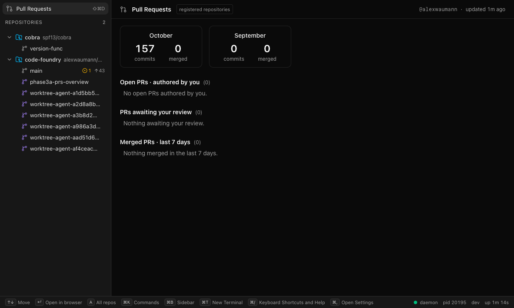
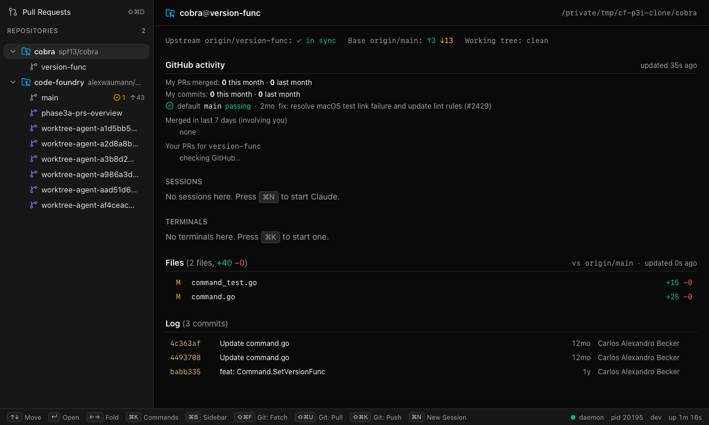
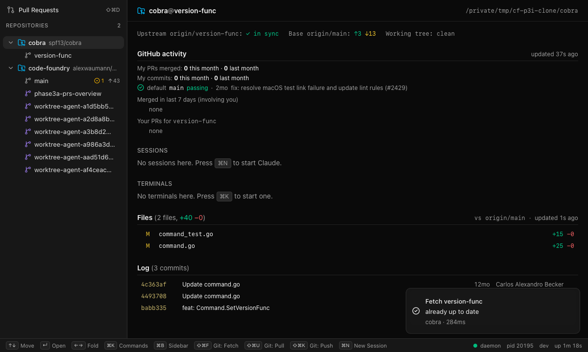

# Phase 3 integration

Status: done on `main`. The work was the 3a merge plus an integration pass. `make check`
is green and `make gui-e2e` passes 102/102 (51 WebKit, 51 Chromium, none skipped). A live
smoke ran against a real daemon and the Vite GUI on 2026-10-08.

## Commits

| Commit | Change |
|---|---|
| `merge: phase 3a Pull Requests page and worktree overview` | The 13 conflicts, resolved below |
| `chore: rename the Go module to github.com/alexwaumann/code-foundry` | Module path, imports, codegen, bundle id, fixtures |
| `feat(daemon): github.dashboards_enabled turns the dashboard poll off` | 3b's setting now has a consumer |
| `fix(gui): the app menu no longer binds session chords` | Custom View menu; more reserved chords |
| `fix(gui): the empty Terminals list names terminal.new's chord` | It said ⌘K (the palette) instead of ⌘T |
| `docs: …` | PLAN status and open items, CLAUDE.md commands, this note |

## Merge resolutions (3a into main with 3b, 3c and 3d)

| File | Resolution |
|---|---|
| `proto/codefoundry/v1/ui.proto` | Both sides had the same `ShowView show_view = 6` and `ShowView{name = 1}`. Only the comment conflicted. It now lists `help`, `settings`, `pullrequests`. `events.proto` was intact: gitops 6, settings 7, update 10. `make gen` regenerated `ui.pb.go` and `ui_pb.ts`. |
| Migrations | No clash. main has 0001–0003 only, and 3b/3c/3d added no migration. `0004_gh_activity.sql` keeps its number. |
| `view.open.url` | 3c already registers `view.open.url` (same name, same `url` arg) as a gitops operation. 3a's duplicate was deleted from `commands_view.go` with its test; 3c's store test covers the same URL validation cases. `RegisterView(r, e)` now registers only `view.pullrequests`. `openUrl()` in `stores/gh.ts` already used the surviving name. The mock's duplicate in `mock/github.ts` was removed, so `mock/gitops.ts` serves it. |
| `internal/command/all/all.go` | Union. `Deps.OpenURL` dropped; `RegisterView(r, d.Emitter)` follows gitops, settings and update. |
| `internal/command/commands_test.go` | Union of the expected names, plus `view.pullrequests`. |
| `internal/daemon/stores.go` | main's settings-driven `openStores`. 3a's `SearchAs: os.Getenv("CODE_FOUNDRY_GH_SEARCH_AS")` moved into `ghOpts`. |
| `internal/api/events_test.go` | Union. The snapshot order is repo, terminal, session, gh (viewer, dashboard, prs), gitops, settings, update, ui. The live section runs the gitops push pair, then 3a's gh and repo-detail events. |
| `gui/frontend/src/api/events.ts` | Union of imports. `gh` maps through 3a's `toGhEventView`. |
| `gui/frontend/src/stores/events.ts` | `gh: applyGhEvent`, `gitops: applyGitOpsEvent`. |
| `gui/frontend/src/stores/intents.ts` | One `showView` case, which calls 3b's `showView()` in `stores/views.ts`. That function now routes 3a's `viewNames` (`pullrequests`) to `ui.select({kind: "view"})`. It also closes settings and help, which covers re-selecting a page that is already selected. |
| `gui/frontend/mock/server.ts` | Union of header docs, routes (GhService, SettingsService) and control cases. A missing `break` after `GET /__mock/update` was added; the merge had made it fall through into the gh cases. |
| `gui/frontend/mock/world.ts` | Union: `gitops`, `settings`, `update` and `gh` worlds. |
| `docs/ARCHITECTURE.md` | Service list: 3a's RepoService/GhService RPCs plus 3c's GitOpsService. §4 now lists all 11 services in `proto/`. |
| `internal/api/gh_activity_test.go` | 3a's file was not gofmt'd, and main's new gofmt gate in `make check` caught it. |

## Module rename

The module path is now `github.com/alexwaumann/code-foundry`, matching the GitHub repo.
The old owner segment was the same handle without "lex". It was replaced with one
`git grep -lI <old> | xargs sed -i ''` pass, which is safe because the new name does not
contain the old one, followed by `make gen`. The change covers:

* `go.mod`, every Go import, `buf.gen.yaml` `go_package_prefix`
* Makefile and `scripts/package.sh` ldflags
* the regenerated Go/TS code and Wails bindings (now under
  `gui/frontend/bindings/github.com/alexwaumann/…`)
* `docs/ARCHITECTURE.md`
* the bundle identifier, now `dev.alexwaumann.codefoundry` (`gui/build/config.yml`,
  `Info.plist`, `Info.dev.plist`)
* mock and e2e fixture logins

Verification, outside `.git` and other agents' worktrees: zero matches, tracked or
untracked. It uses `/usr/bin/grep`, because `grep` in this shell is an ignore-aware
function.

* The gitignored build outputs were rebuilt: `gui/frontend/dist`, and
  `gui/bin/CodeFoundry.app` with `wails3 task darwin:package`.
* The stale `gui/bin/CodeFoundry.dev.app` was removed. `wails3 dev` recreates it on
  every run.
* Matches remain only in other agents' gitignored worktrees under `.claude/worktrees/`
  (old branches, not touched).

The bundle id change means a fresh WKWebView storage location: persisted GUI state
(sidebar width, collapsed rows) starts from defaults once.

## Settings consumer

(Superseded by `gh-viewer-polling.md`: both github.* settings apply live through
`gh.Options.Config`.) `github.dashboards_enabled` = false sets `gh.Options.DashboardInterval = -1`. The gh store
already treats a negative interval as "poll off" (tested in `activity_test.go`). The field
is now `Restart: true`, like the other GitHub interval, in the schema and in the mock's
copy. Stats and per-repo activity still poll. The page shows the last cached dashboard.

## Keybindings (full merged registry)

`TestKeybindingsAreUniqueAndNotReserved` passes. 3d binds no chords.

| Command | Chord | From |
|---|---|---|
| session.new | cmd+n | 2 |
| session.rename | cmd+r | 2 |
| session.reconnect | cmd+shift+r | 2 |
| session.close | cmd+shift+w | 2 |
| terminal.new | cmd+t | 1 |
| view.pullrequests | cmd+shift+d | 3a |
| view.settings | cmd+, | 3b |
| view.help | cmd+/ | 3b |
| git.fetch | cmd+shift+f | 3c |
| git.pull | cmd+shift+u | 3c |
| git.push | cmd+shift+k | 3c |
| worktree.open.editor | cmd+shift+o | 3c |

Reserved chords (`command.ReservedChords`, mirrored in `src/settings/validate.ts` and
`mock/settings.ts`):

| Source | Chords |
|---|---|
| GUI view actions | cmd+k, cmd+shift+p, cmd+b, cmd+shift+a, cmd+1..9, cmd+=, cmd+-, cmd+0 |
| Editing chords | cmd+c, cmd+v, cmd+x, cmd+a, cmd+z, cmd+shift+z |
| App menu | cmd+w, cmd+q, **cmd+h, cmd+alt+h, cmd+m, cmd+ctrl+f** (new) |

**Collision found and fixed.** No two commands collided. The collision was with the
Wails menu: `application.ViewMenu` binds Reload (cmd+r) and Force Reload (cmd+shift+r),
which are session.rename's and session.reconnect's chords, and Zoom (cmd+0/=/-), which are
the GUI's font-size view actions. Menu key equivalents fire whenever the page leaves the
key unhandled, so cmd+r with no session selected would have reloaded the GUI.

* `gui/app.go` now builds its own View menu with Toggle Full Screen, plus Developer Tools
  in non-production builds (`AddRole(OpenDevTools)` is nil in production).
* The other menu chords joined the reserved list, so neither commands nor user overrides
  can take them.
* Not yet checked in a running Wails window (see Open items).

## Live smoke (2026-10-08, WebKit, real daemon)

Setup:

* `CODE_FOUNDRY_HOME=$(mktemp -d)` with `make build && ./bin/code-foundry daemon --dev`
* this repo registered, plus `/tmp` blobless clones of `spf13/cobra` on `version-func`
  (3 commits ahead of `origin/main`, 13 behind)
* Vite on 9267 with `VITE_DAEMON_URL/TOKEN`, as in `phase2-integration.md`
* a throwaway Playwright spec, deleted afterwards

No Claude session was created.

| Check | Observed |
|---|---|
| Pull Requests page (cmd+shift+d → ShowView) | Rendered. `@alexwaumann`, "updated 1m ago". Tiles: October 157 commits, 0 merged; September 0/0. All three lists empty ("No open PRs authored by you." …), which is correct for this account. |
| Overview, code-foundry@main | Base `origin/main`. main is **not** equal to base during this pass: 43 local merge and integration commits are unpushed, so the overview showed 341 files (+38700 −926) and a 43-commit log. "Working tree: 1 new" was the temporary spec. The overview would be empty vs base after a push. |
| Overview, cobra@version-func | "Upstream origin/version-func ✓ in sync · Base origin/main ↑3 ↓13 · Working tree clean". GitHub activity: default `main` passing; merged and commit counts 0 (not the viewer's repo); branch PRs "none". Files: 2 (`command.go` +25, `command_test.go` +15). Log: 3 commits (`4c363af`, `4493708`, `babb335`). |
| Settings (cmd+,) | Opened. Setting font size to 15 wrote `font_size = 15` to `settings.toml`. It was reset afterwards with `settings reset --key appearance.font_size`. |
| Help (cmd+/) | Opened. Lists `view.pullrequests` with ⇧⌘D. |
| `code-foundry git fetch --worktree <cobra>` | CLI: "already up to date". GUI toast: "Fetch version-func · already up to date · cobra · 284ms". |
| Footer updater | Idle: no update indicator. Footer shows "daemon pid … dev up 1m 18s". `app.version`: "Code Foundry dev (8d294f7…); updates disabled (dev build)". |

Afterwards Vite and the scratch daemon were stopped by PID, and the scratch home and the
clone were removed. The user's own daemon (pid 48474) was not touched. `make build`
replaced `./bin/code-foundry`, the binary that pid 48474 runs. The running process is
unaffected, but its next restart picks up the new build.

## Gotchas

* **The `break` lost in a union merge.** When two sides append `case` blocks to the same
  switch, check the last line of the first side. Here the merged `GET /__mock/update` fell
  through into the gh cases.
* **`grep` here is a shell function** that respects ignore files. Use `/usr/bin/grep` for
  "nothing left anywhere" checks.
* The live Playwright config matches `live(-[a-z]+)?.spec.ts`, so a spec named with digits
  (`live-p3smoke`) is silently not found.
* Overviews of this repo list every `.claude/worktrees/agent-*` worktree that other agents
  left behind. They are real git worktrees.

## Open items

See `docs/PLAN.md` → Open items. The ones from this pass:

* The menu change is not yet checked in a packaged Wails window.
* Every link opened from the Pull Requests page and overview shows a short gitops "Open
  <url>" toast.
* `git.push --force-with-lease` still has no confirm.
* `status_reason` is not displayed in the GUI.
* Homebrew tap deferred; Finder double-click unverified; populated PR lists seen only
  through `CODE_FOUNDRY_GH_SEARCH_AS`.
