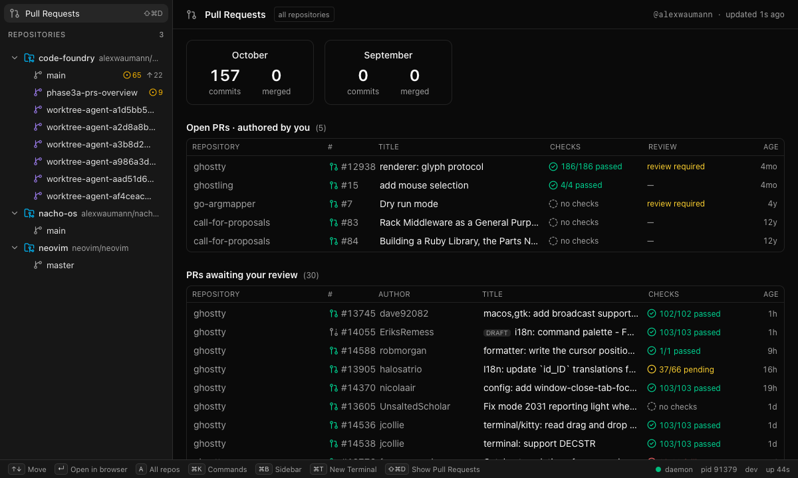
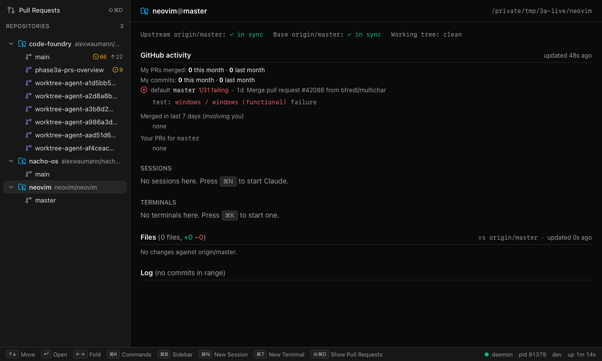
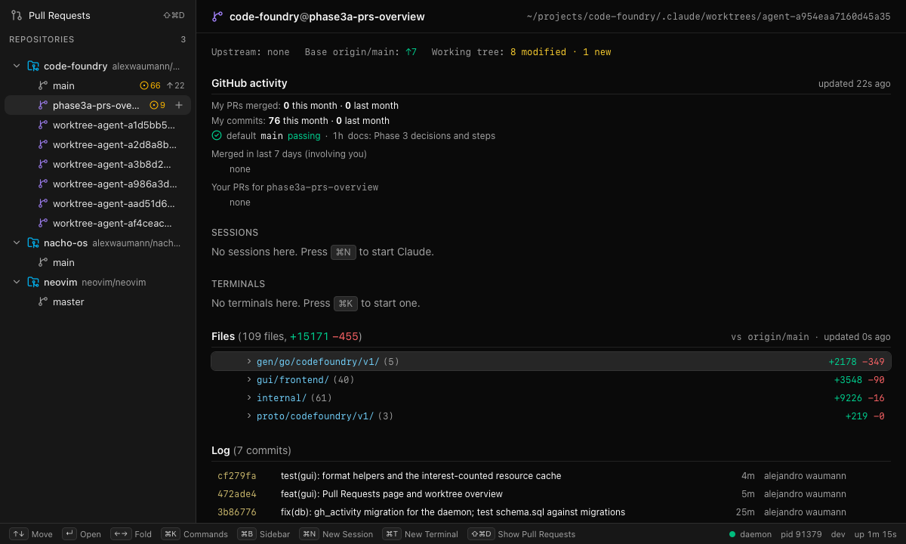

# Phase 3a: Pull Requests page and worktree overview

> **Polling superseded** by `gh-viewer-polling.md`: the three searches, stats, default-branch
> CI, and branch PRs below are now parts of one fingerprint poll per interval, with
> details fetched only for what changed. The page and overview behave as described.

Status: done on branch `phase3a-prs-overview`. `make check` is green and `make gui-e2e`
passes (WebKit and Chromium). The behaviour was exercised live against a real daemon with
three repos registered:

* this repository, `alexwaumann/code-foundry`
* `/tmp/3a-live/nacho-os`, the viewer's own repo, which has commits this month
* `/tmp/3a-live/neovim`, a blobless shallow clone whose `master` was failing CI at the time



## What landed

| Area | Files |
|---|---|
| Protos (additive) | `gh.proto`: `GetDashboard`, `GetRepoActivity`, `GetBranchPullRequests`; `PullRequest.state/created_at/merged_at`; `GhEvent.dashboard_updated/repo_activity_updated/branch_pull_requests_updated`. `repo.proto`: `GetWorktreeDetail`, `RepoEvent.worktree_detail_updated`. `ui.proto`: `UiIntent.ShowView{name}` |
| gh store | `internal/store/gh/activity.go` (types, scheduling, jobs), `activity_decode.go`, `activity_cache.go`, `runner_rest.go` (`RESTRunner`, `gh api -X GET`), five queries plus three fragments under `queries/`. Small hooks in `store.go` (`jobActivity`, `next()`), `poll.go` (page one selects default-branch CI), `gh.go` (types) |
| repo store | `internal/store/repo/detail.go` (`WorktreeDetail`, `jobDetail`, parsers). Hooks: one line in `runJob`, one field on `Git`, one method on `Store` |
| DB | `internal/db/migrations/0004_gh_activity.sql` (mirrored in `gh/schema.sql`; a test checks they agree) |
| API | `internal/api/gh_activity.go`, `repo_detail.go`; the new gh events on `GhService.Watch` and the EventService gh adapter; repo detail events through `eventToProto` |
| Commands | `internal/command/commands_view.go`: `view.pullrequests` (cmd+shift+d, emits `ShowView`) and `view.open.url` (opens http(s) with `/usr/bin/open`). Registered in `all.go` |
| GUI | `src/api/gh.ts`, `src/api/worktreeDetail.ts`, `src/stores/{resource,gh,worktreeDetail}.ts`, `src/lib/{nav.ts,NavRow.tsx,clock.ts}`, `src/components/prs/*`, `src/components/overview/*`. Small edits to `App.tsx` (route), `Sidebar.tsx` (entry), `Dashboard.tsx` (routes repo/worktree to the overview; keeps the sessions/terminals lists as `WorktreeItems`), `hints.ts`, `ui.ts` (`Selection.view`), `intents.ts`, `events.ts`, `context.ts`, `selection.ts`, `api/{repo,ui,events}.ts` |
| Mock / e2e | `mock/github.ts` (+ routes in `server.ts`, three hooks in `world.ts`), `e2e/prs.spec.ts` (9 tests), opt-in `e2e/live-prs.spec.ts` |

## GitHub queries and measured costs

Every request is `gh api graphql` (or `gh api -X GET` for REST) on the store's single
paced worker, so it shares MinGap, the rate-limit pauses, and the auth handling with the
Phase 1c polls. Every GraphQL query below reported `rateLimit.cost = 1`. Times are wall
times from this machine on 2026-10-08, including gh's process start (~0.3s).

| What | Query | Cadence | Measured |
|---|---|---|---|
| Open PRs authored by you | `search(type: ISSUE, first: 50)` `is:pr is:open archived:false author:@me sort:updated-desc`, with `PullRequestReview` (reviewDecision and rollup counts) | 2 min | 0.7–1.8s |
| PRs awaiting your review | the same, `review-requested:@me`, `first: 30` | 2 min | 0.9s (empty), 3.9–6.0s with 30–50 busy-repo PRs |
| Merged in the last 7 days involving you | `search(type: ISSUE_ADVANCED, first: 50)` `is:pr is:merged merged:>=<now-7d> (author:@me OR reviewed-by:@me OR assignee:@me)`, summary fields only | 2 min | 0.8–1.3s |
| Global monthly stats | `viewer_stats.graphql`: two `search(first: 0) { issueCount }` (`author:@me merged:<month>`) plus `user(login).contributionsCollection` × 2 | 15 min | 0.8–1.6s |
| Global commits | REST `search/commits?q=author:@me author-date:<month range>&per_page=1` → `total_count`, × 2 | 15 min | 0.5–1.5s each |
| Per-repo monthly stats | `repo_stats.graphql`: `defaultBranchRef.target.history(author: {id}, since, until) { totalCount }` × 2 plus two repo-scoped merged searches | 15 min per tracked repo | 0.85–0.9s (ghostty with 127 commits too) |
| Default-branch CI | `DefaultBranchFields @include(if: $withDefaultBranch)` on PR-list page one: the head commit with `contexts(first: 100)`; more pages through `checks.graphql` by oid when failures are not all on page one | with the PR poll (60s) | page one +0.6s (ghostty 2.5→4.1s; neovim 2.1s); deno needed one extra page (0.7s) |
| PRs for a branch | `repository.pullRequests(headRefName:, states: [OPEN, MERGED, CLOSED], first: 10)`; keeps non-fork PRs by the viewer | 60s while watched | 0.45–0.8s; 2.2s for `main` on ghostty (all forks) |
| SearchAs id | `user(login) { id }` (dev knob only) | once | 0.35s |

Budget: dashboards cost 3 points every 2 minutes (90/hour), global stats 1 point plus
2 REST searches every 15 minutes, and repo stats 1 point per tracked repo every 15
minutes. Default-branch CI rides on a request that already happens, so it adds nothing.
Branch PRs cost 1 point per watched branch per minute, and only while the overview is
open. REST search has its own limit (30/min); a rate-limit error there does not pause
GraphQL polling.

Why these shapes:

* **Three requests, not one.** One document with all three searches and review fields
  returned **HTTP 502** (GitHub's 10s timeout) when run for a busy account. reviewDecision
  and the check counts cost about 100ms of server time per PR, so review requests get
  `first: 30`, the merged list skips them, and a 502 halves that section's size
  (sticky, floor 10).
* **`ISSUE_ADVANCED`** is the search type that accepts `OR` and parentheses. With
  `type: ISSUE`, the same query string returned 0 results.
* **`review-requested:@me` already includes team requests.** `user-review-requested:`
  is the direct-only variant, so the "or their teams" part costs nothing.
* **Commits.** REST `search/commits` (with `@me`) matches what we want, as the brief
  asked. The per-repo count uses `history(author: {id})` on the default branch instead:
  it is one GraphQL request per repo rather than two REST searches, and it agreed exactly
  with REST in every check (nacho-os 81 = 81, ghostty/mitchellh 127 = 127).
  `contributionsCollection` is fetched in the same request as the merged counts and used
  when REST fails or the runner has no REST. It buckets by UTC day, so it can be a few
  off at month edges (79 vs 81, 21 vs 22 observed). `commits_source` says which one was
  used.
* **Month windows** are calendar months in the daemon's local zone, sent as
  `2026-10-01T00:00:00-05:00..2026-10-31T23:59:59-05:00`. Both `merged:` and
  `author-date:` accept offset timestamps (verified).
* **Dashboards are fetched unfiltered and filtered at read time** to tracked slugs
  (`GetDashboard.include_untracked` turns the filter off; the page toggles it with A).
  That avoids search-query length limits with many repos. The limit of this approach: a
  viewer with more than 50 (30) matches outside registered repos can crowd out
  registered ones.
* **Dashboards and stats poll only while at least one repo is tracked.**

## Worktree detail

`RepoService.GetWorktreeDetail(repo_id, path)` runs these, in the worktree:

1. `git merge-base HEAD <base>`. The base is `status.base_ref` (`origin/<default>`); without
   one, the local default branch when the worktree is on another branch; otherwise none.
2. `git diff --name-status -z -M <mb> HEAD`: committed changes on the branch.
3. `git log -n 100 --format=%H%x1f%h%x1f%an%x1f%ae%x1f%at%x1f%s%x1e <base>..HEAD` and
   `git rev-list --count <base>..HEAD`.
4. `git diff --name-status -z -M HEAD`: tracked working-tree and index changes. The empty
   tree replaces HEAD on an unborn branch.
5. `git diff --numstat -z -M <mb>`: +/− from the merge base to the working tree.
6. `git ls-files --others --exclude-standard --directory --no-empty-directory -z`:
   untracked files. Untracked directories are one `dir/` entry; untracked files get a
   line count (first 8 MiB, NUL in the first 8000 bytes means binary).

All diffs pass `--no-ext-diff --no-color`. Files are merged by path, and a working-tree
status letter wins over the committed one (`uncommitted` is set). The list is capped at
2000 entries.

**When it runs.** The first call computes synchronously (about 0.1s on this repo).
`GetWorktreeDetail` records the time of each call. While a worktree was asked about in the
last 10 minutes, every status job for it (fs events, the 30s poll, Refresh) schedules a
`jobDetail` afterwards on the same scheduler. Within the window, calls are served from
the cache, and `WorktreeDetailUpdated` is published only when the result changed. Nothing
runs for worktrees nobody is looking at (`TestWorktreeDetailOnlyWhenWatched`). The GUI
re-calls every 5 minutes while the page is open, which keeps the window open.

**A clean worktree skips steps 4 and 6**, and step 5 becomes `git diff --numstat <mb>
HEAD`, a tree-to-tree diff. The status job that triggered the detail ran just before it,
so "clean" is current. On the neovim checkout (~4k files) steps 4 and 5 took about 200ms
each, because they stat the whole tree. With the shortcut the detail takes about 0.1s.

## GUI

* **Pull Requests page.** It is reachable three ways:
  * the "Pull Requests" entry above the tree
  * `cmd+shift+d`, which is `view.pullrequests`'s registry keybinding: the daemon emits
    `UiIntent.ShowView{"pullrequests"}` and the GUI switches
  * the same command from the palette or the CLI (`code-foundry view.pullrequests`)

  `Selection` gained `{ kind: "view", name }`, and `UiContext.active_view` is then
  `"pullrequests"`.
* **Layout.** Monthly tiles, then three tables:

  | Table | Columns |
  |---|---|
  | Open PRs authored by you | repo · # · title · checks · review · age |
  | Awaiting your review | repo · # · author · title · checks · age |
  | Merged in the last 7 days | repo · # · author · title · merged |

  The header shows `@login`, "updated Ns ago" (amber and "stale" past 5 minutes, red when
  the last poll failed, with the error as the tooltip), and the scope toggle.
* **Worktree overview** (a worktree row; a repo row shows its main worktree, with every
  session in the repo):
  * header `repo@branch` and path
  * sync line: upstream ahead/behind, base ahead/behind, working tree summary
  * GitHub activity: merged/commits this and last month, default-branch CI with failing
    checks, merged in 7 days involving you, your PRs for the branch with checks and review
  * Sessions and Terminals (2c's lists)
  * Files vs base as a tree: directories first, single-child chains compressed,
    aggregated +/− and counts; expanded under 40 files, collapsed above
  * Log vs base: short sha, subject, age, author
* **Keyboard.** Each page is one focusable list (`lib/nav.ts`) with
  `aria-activedescendant`:
  * ↑/↓ or j/k, Home/End move the cursor
  * Enter opens the PR or check log, a commit on GitHub, or toggles a directory
  * ←/→ fold directories
  * E / Shift-E expand or collapse all directories
  * A toggles the PR page's scope

  Double-click also opens. Links go through the registry (`view.open.url`), never
  `window.open`.
* **Virtualization.** `RowList` renders directly up to 60 rows and virtualizes beyond that
  (fixed row height). When the cursor moves to a row that is not mounted, the list
  scrolls to it first. A page has at most 50 + 30 + 50 PR rows. Files can reach 2000.
* **Data flow.** `stores/resource.ts` is an interest-counted cache of unary reads: a
  component watches the key it shows, gh and repo events invalidate keys, and only watched
  keys are re-fetched (one in flight per key, with coalesced reruns). Event routing:

  | Event | Invalidates |
  |---|---|
  | `dashboard_updated` | the dashboard, and all repo activity (activity includes the dashboard's merges) |
  | `repo_activity_updated`, `pull_requests_updated` | that slug's activity |
  | `branch_pull_requests_updated` | that branch |
  | `worktree_detail_updated` | that detail |
  | a repo snapshot (reconnect) | all details |

  Still one EventService stream and no new streams: everything else is unary.
* The sidebar entry's chord comes from the registry, not from the frontend.

## Live verification (2026-10-08)

Recipe:

```sh
export CODE_FOUNDRY_HOME=/tmp/3a-home
make build && ./bin/code-foundry daemon --dev &
./bin/code-foundry repo register --path "$PWD"
git clone https://github.com/<you>/<repo> /tmp/3a-live/<repo>      # a repo with your commits
git clone --filter=blob:none --depth 200 https://github.com/neovim/neovim /tmp/3a-live/neovim
./bin/code-foundry repo register --path /tmp/3a-live/<repo>; ./bin/code-foundry repo register --path /tmp/3a-live/neovim
cd gui/frontend
VITE_DAEMON_URL=http://127.0.0.1:$(cat $CODE_FOUNDRY_HOME/daemon.port) VITE_DAEMON_TOKEN=$(cat $CODE_FOUNDRY_HOME/daemon.token) \
  ./node_modules/.bin/vite --port 9257 --strictPort --host 127.0.0.1 &
LIVE_DAEMON=1 LIVE_APP_URL=http://127.0.0.1:9257 LIVE_REPO=neovim LIVE_WORKTREE=<a worktree path> \
  LIVE_SHOTS=<dir> pnpm run e2e:live e2e/live-prs.spec.ts
```

Observed:

* `buf curl GetDashboard` returned viewer `alexwaumann`, authenticated, tracked slugs
  `alexwaumann/code-foundry`, `alexwaumann/nacho-os` and `neovim/neovim`, and stats
  `2026-10`: 157 commits (`commits_source: search`), 0 merged. The three lists were empty,
  which is correct: this account has no pull requests anywhere.
* `GetRepoActivity neovim/neovim`: default `master` `27ee55c`, rollup FAILURE 30/31, failing
  `windows / windows (functional)` (workflow `test`) with its Actions job URL.
  `alexwaumann/nacho-os`: 81 commits this month and no checks.
* `GetWorktreeDetail` on this worktree: base `origin/main`, merge base `c82f197`, 72
  files, and the branch's commits in the log.
* GUI (WebKit, real daemon): `cmd+shift+d` ran `view.pullrequests`, and the daemon's
  ShowView intent switched to the page. The neovim overview showed the failing check.
  This worktree's overview showed 109 files collapsed under 4 directories and 7 commits.
* **Populated PR page.** The account has no PRs, so the daemon was restarted with
  `CODE_FOUNDRY_GH_SEARCH_AS=mitchellh` (a development knob: the searches, stats, and
  branch filter use that login instead of `@me`) and the page was switched to "all
  repositories". The screenshot at the top shows real data from that run.
  * Its tiles still show this account's numbers: the stats cache was younger than its
    15-minute interval, so the stats were not refetched after the restart.
  * GitHub does not compute reviewDecision for repos without branch protection, hence
    the "—" entries.




## Gotchas

* **The daemon does not run `gh.Migrate`.** It applies `internal/db/migrations`, and
  `gh/schema.sql` is only for the store's tests. The first live run logged `no such
  table: gh_activity` on every cache write. 0004 fixes it, and
  `TestDaemonMigrationsCreateEveryGhTable` now catches a mismatch.
* `TestStoreRefreshAndUntrack` (1c) raced: it read the viewer call count after the fake
  recorded the first viewer call but before `pollViewer` rescheduled, so that reschedule
  overwrote `Refresh("")`. The test now waits for the first viewer poll to finish. An
  in-flight viewer fetch already satisfies a refresh.
* Search nodes are a union; `__typename` is selected and non-PullRequest nodes are
  skipped.
* `pkill -f "code-foundry daemon --dev"` would also kill other agents' dev daemons. Stop
  your own by pid.
* With macOS `open`, `view.open.url` in an automated live run would open the user's
  browser. The live spec never activates a row; the mock records invocations instead.

## Deviations from the brief

* `view.open-url` is named **`view.open.url`**, because command names must match
  `^[a-z]+(\.[a-z][a-z0-9]*)+$` (no hyphens). It opens the URL daemon-side with
  `/usr/bin/open` (http/https only), so the CLI gets it too.
* `view.pullrequests` returns no message (only `--json` delivery), so the GUI does not
  toast `delivered=1` on every page switch.
* Per-repo commit counts use GraphQL `history(author:)` instead of REST `search/commits`
  (same numbers, one request instead of two). The global count uses REST as asked, with
  `contributionsCollection` as the fallback.
* Branch PRs are kept only when authored by the viewer and from the repo itself (not
  forks), as the brief specifies. A colleague's PR on a checked-out branch is not shown.
* The overview's sync line replaces 2c's upstream/ahead/behind/changes grid, and the
  header moved to the page bar. The Sessions and Terminals lists are unchanged.
* An extra RPC field, `GetDashboardRequest.include_untracked`, plus the dev-only
  `CODE_FOUNDRY_GH_SEARCH_AS` environment variable (`gh.Options.SearchAs`).
* `GitStatusView` gained optional `baseRef/baseAhead/baseBehind/error`. They are
  optional so that other branches' test literals keep compiling.

## Merge notes

* **Migration number.** `0004_gh_activity.sql` may clash with 3b, 3c or 3d. Duplicate
  numbers fail loudly in `LoadMigrations`; renumber ours if needed. The file has no
  dependencies.
* **`view.open.url` vs 3c's `pr.open`.** It is marked `TODO(phase3 merge)` in
  `commands_view.go`. If 3c lands an equivalent, point `openUrl()` in
  `gui/frontend/src/stores/gh.ts` at it and drop one. Ours takes `url`.
* **`ui.proto`**: `ShowView` is field 6 of `UiIntent`. If another step also added an
  intent at 6, renumber one of them (both are unreleased). The GUI ignores unknown view
  names, so 3b's settings page could reuse `ShowView{"settings"}` by adding a name to
  `viewNames` in `stores/ui.ts` and a branch in `App.tsx`'s `Content`.
* **Reserved chords.** cmd+shift+d is a command chord, not a view action, so the
  reserved list needed no change. The registry-wide uniqueness test covers it.
* **Shared GUI files touched:** `App.tsx` (+2 lines), `Sidebar.tsx` (+2), `Dashboard.tsx`
  (overview routing), `hints.ts` (+6), `stores/ui.ts` (+5), `stores/events.ts` (+3),
  `stores/intents.ts` (+3), `stores/context.ts` (+2), `api/{repo,ui,events}.ts`, and
  `playwright{,.live}.config.ts` (the live match is now `live(-x)?.spec.ts`).
* `gh.Service` gained `BranchPullRequests`, and `repo.Store` gained `WorktreeDetail`.
  Any other implementation needs them; the fakes (`ghtest`, `repotest`) have them.
