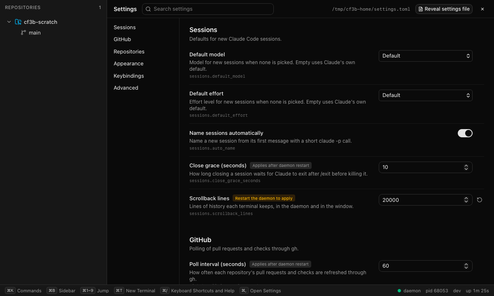
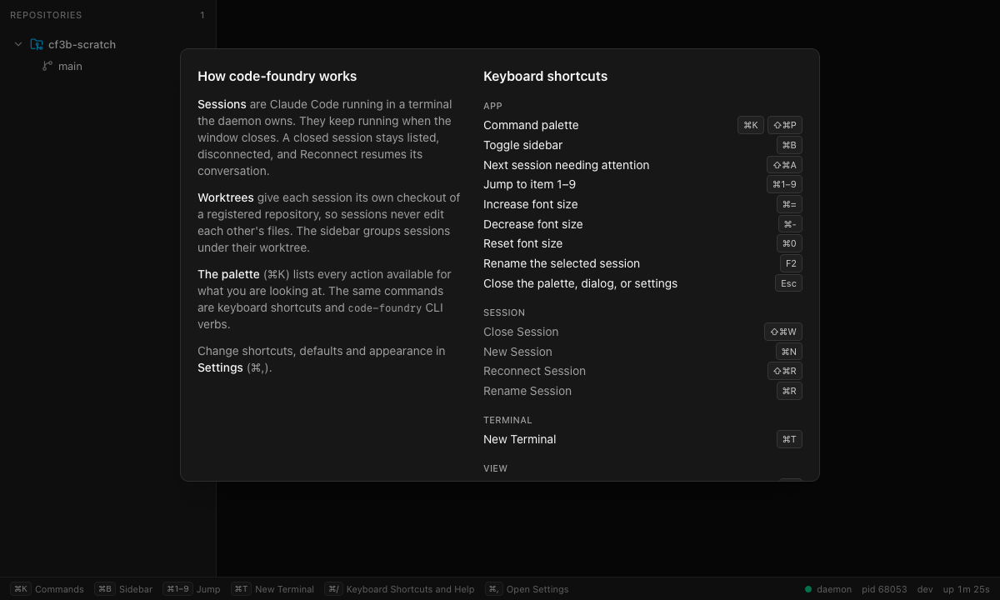

# Phase 3b: Settings, help overlay, confirm prompts

Status: done on this branch.

* `make check` green.
* `make gui-e2e` 60/60 (WebKit + Chromium). That is 44 existing tests plus 16 new ones, and
  120/120 across two repeats.
* Live check against a real daemon (isolated `CODE_FOUNDRY_HOME=/tmp/cf3b-home`, scratch repo
  in /tmp, no Claude sessions), in WebKit through the Vite dev server:
  * hand-editing `settings.toml` (`font_size = 17`, `theme = "light"`) updated the open
    settings page and switched the window to light;
  * typing 16 into "Terminal font size" rewrote the file to `font_size = 16`;
  * CLI `settings set keybindings.terminal.new cmd+shift+t` showed up as
    `Keybindings: cmd+shift+t` in `help terminal new`, and `sessions.default_model haiku`
    became session.new's `--model` default;
  * `terminal kill` without a terminal attached printed the prompt plus "Re-run with
    --yes" (exit 2); with `--yes` it reached the store.




## Settings store (`internal/store/settings`)

* **File:** `$CONFIG/settings.toml`. On macOS that is
  `~/Library/Application Support/code-foundry/settings.toml`, or
  `$CODE_FOUNDRY_HOME/settings.toml`.
* **Why TOML, not JSON:** the file is meant to be edited by hand. TOML allows comments,
  so the rendered file documents every field and shows its default. It also has no
  trailing-comma or quoting traps. `BurntSushi/toml` was already in the module graph
  through Wails and is now a direct dependency.
* **Format:** one table per group, keys without the group prefix. Unset fields are
  written as commented-out defaults.

  ```toml
  [sessions]
  # Default model. Model for new threads when none is picked. One of: "fable", ...
  # default_model = "opus"
  auto_name = false

  [appearance]
  font_size = 15

  [keybindings]
  "session.new" = "cmd+shift+n"   # or "none" to unbind
  ```

  Unquoted dotted keys under `[keybindings]` (`session.new = ...`) parse as nested
  tables and are flattened back. Values are read leniently: `14` and `"14"` both work.
* **Typed struct plus a field registry:** `Settings` (Sessions, GitHub, Repos, Appearance,
  Keybindings, Advanced) is filled from `staticFields`. Each field has a key, title,
  description, group, type, enum values, default, restart flag, min/max, placeholder, a
  `bind` pointer into the struct, and an optional `check`.
* **One validation path:** the file loader and `Update` both go through
  `resolve(raw, cmds)`. A rejected value falls back to its default and is reported in
  `Snapshot.Issues`. Unknown keys are reported but otherwise ignored.
* **`Update(partial)`:** `""` resets a key to its default.
  * The whole result is validated first. Any rejected key in the partial fails the update
    with `*ValidationError` and nothing is written.
  * The file is rewritten atomically (temp file, fsync, chmod 0600, rename).
  * While the file does not parse, `Update` refuses with `ErrFileInvalid`. Overwriting the
    file would throw away the user's unparsed edits.
* **Live reload:** fsnotify watches the config directory, not the file, because an atomic
  save replaces the file. Events are filtered by name and debounced (100 ms).
  * A syntax error keeps the previous values and sets `LoadError`.
  * A deleted file means defaults.
  * The reload after our own write is a no-op: `raw` is set to exactly what was written,
    and unchanged state is never published.
* **Publishing:** `settings.Changed{Snapshot}` on the bus, with `Revision`, `Issues`,
  `LoadError` and `RestartPending`. `RestartPending` lists restart-required keys whose
  value differs from the one the daemon started with.
  * `OnChange` hooks run synchronously before the bus event. The command registry
    therefore already reports new keybindings when a client re-lists on that event.
  * `Watch(ctx)` sends the current snapshot, then changes. It resends the latest snapshot
    after drops.
* **Keybinding fields** are generated from the registry (`SetCommands`). There is one
  field per command, keyed `keybindings.<command>`, with the command's first chord as the
  default.
  * Validation uses `command.ValidateBinding`: the chord must parse, must not be reserved,
    and needs cmd/ctrl/alt unless it is a function key.
  * Unknown commands are rejected.
  * So are collisions with another command's effective chord. Swaps in one change are
    allowed. Unbinding a command (`none`) frees its chord.
  * Before `SetCommands` runs, only syntax is checked.
* **Fake:** `settingstest.Fake` is a real Store in a test directory that records
  `Update` calls, so validation in consumer tests never drifts from production.

## Schema

| Key | Type | Default | Applied |
|---|---|---|---|
| `sessions.default_model` | enum `fable, opus, sonnet, haiku` | `opus` (was `""`, Claude's, until the new-thread step) | live: session.new's `model` default |
| `sessions.default_effort` | enum `low … max` | `high` (was `""` until the new-thread step) | live: session.new's `effort` default |
| `sessions.auto_name` | bool | true | live (Namer wrapper) |
| `sessions.close_grace_seconds` | int 1–120 | 10 | **restart** (session `CloseTimeout`) |
| `sessions.scrollback_lines` | int 1000–100000 | 10000 | **restart** (terminal `MaxScrollbackLines`); the GUI's xterm scrollback follows live |
| `github.poll_interval_seconds` | int 15–3600 | 60 | live since `gh-viewer-polling.md` (gh `Config().PollInterval`, the one fingerprint poll); was restart (`RepoInterval`) |
| `github.dashboards_enabled` | bool | true | live since `gh-viewer-polling.md` (the poll drops the searches; the page says so); was restart |
| `repos.fetch_interval_seconds` | int 0–86400 (0 = off) | 120 | **restart** (repo `FetchInterval`) |
| `repos.worktree_dir` | path, `{repo}` expands | `""` = `<repo parent>/<repo>.worktrees` | live (repo.worktree.new) |
| `gitops.editor_command` | string, `{path}` expands (else appended) | `""` = `CODE_FOUNDRY_EDITOR`, then auto-detect | live (worktree.open.editor; added when merging with 3c) |
| `appearance.theme` | enum system/dark/light | system | live (GUI) |
| `appearance.font_family` | string | `JetBrains Mono, SF Mono, Menlo` | live (GUI, fallbacks always appended) |
| `appearance.font_size` | int 9–28 | 13 | live (GUI; cmd+= / cmd+- / cmd+0 save it) |
| `appearance.density` | enum compact/comfortable | compact | live (GUI: sidebar rows 26 / 30 px) |
| `keybindings.<command>` | keybinding | the command's chord | live (CommandService.List) |
| `advanced.claude_path` | path, executable | `""` (PATH) | **restart** (session `Claude`, namer) |
| `advanced.gh_path` | path, executable | `""` (PATH / Homebrew) | **restart** (gh `ExecRunner.Path`) |
| `advanced.log_level` | enum debug/info/warn/error | info | live (file handler `LevelVar`; `--dev` always logs debug) |

* **Verified model list:** `claude --help` on Claude Code 2.1.294 accepts an alias
  (`fable`, `opus`, `sonnet`; `haiku` also works) or a full model name, and
  `--effort low|medium|high|xhigh|max`. The enum reuses `command.SessionModels` and
  `SessionEfforts`, so the settings and session.new lists cannot diverge.
* **Restart-required fields** are marked in the schema (`restart_required`). The UI shows
  "Applies after daemon restart" on each of them, and the amber badge "Restart the daemon
  to apply" once they are in `restart_pending`. Restarting is 3d's `daemon.restart`.

## Where the consumers are wired (`internal/daemon`)

* **Start-time values:** `stores.go` opens the settings store first and passes these as
  store options: fetch interval, gh poll interval and path, scrollback, claude path and
  close grace. No store package was edited; they already took these options.
* **Live values (`settings.go`):**
  * `applySettings` calls `SetCommands` with the registry's commands. Its `OnChange` hook
    calls `Registry.SetOverrides` (keybindings and session.new arg defaults) and sets the
    log `LevelVar`.
  * `settingsNamer` checks `auto_name` per session. When it is off, the session store
    logs one "auto-naming failed … turned off in settings" warning per session.
  * `worktreeDirRepo` decorates the RepoBackend handed to the commands. It fills
    `CreateWorktreeRequest.path` from `repos.worktree_dir` when the request has none.

## Confirm prompts

* **Command side:**
  * `Command.Confirm` is a message template. Each `{arg}` placeholder is validated at
    Register and rendered from the parsed args, after context defaults. Absent bools
    render as `false` and other absent args as `(none)`.
  * `Registry.Invoke(..., command.Confirmed(true))`. Without that option, Invoke checks
    name, arg syntax, availability and required args, then returns `*ConfirmError`
    (`ErrNeedsConfirmation`) instead of running. Missing args are therefore reported
    before the user is asked.
  * `Invoke` takes variadic options, so existing callers compile unchanged.
* **API:** `CommandService` maps the error to FailedPrecondition with a
  `ConfirmationRequired{command, message, title}` detail. `Command.requires_confirmation`
  is listed, and `InvokeCommandRequest.confirmed` runs the command.
* **Marked:** `repo.unregister`, `repo.worktree.remove`, `session.remove`,
  `terminal.kill`. The edits are one line each.
* **GUI:** `runCommand` catches the detail and shows `ConfirmDialog` (the destructive
  button has focus: Enter confirms, Escape cancels), then re-invokes with
  `confirmed=true`. The palette, keybindings, the "Not connected" Remove button and the
  CLI all go through it.
* **CLI:**
  * Confirm-required commands get `--yes`.
  * Without it, on a terminal (stdin and stderr are TTYs) the CLI prompts `[y/N]`. Without
    a terminal it prints the message and "Re-run with --yes to confirm." (exit 2).
  * Declining exits 1.
  * `yes` is now a reserved arg name.

## Help overlay and views

* **Commands:** `view.help` (cmd+/) and `view.settings` (cmd+,) emit
  `UiIntent.ShowView{name}`.
  * In the GUI their chords are presented locally through `commandPresenters`, so only
    this window opens and there is no round trip.
  * The palette and the CLI go through the daemon, so every window opens.
* **The overlay lists:**
  * the GUI's own chords (view actions merged by title, F2, Esc);
  * every command with an effective keybinding, grouped by category. These come from
    `CommandService.List(include_unavailable)` when the overlay opens. Unavailable
    commands are dimmed, not hidden;
  * a four-paragraph "how this app works" (sessions, worktrees, palette, settings).
* **Settings page:** replaces the content area (`stores/views.ts`). Selecting something in
  the sidebar or pressing Escape outside a field leaves it.

## Settings UI

* **Data flow:** the form is generated from `GetSchema`, fetched when the page opens.
  Values come from settings snapshots on the one `EventService.Watch` stream (new source
  `EVENT_SOURCE_SETTINGS`). The connection budget is unchanged: one stream plus one Attach.
* **Editors by type:**
  * bool: a switch;
  * enum: a select (`""` shows as "Default");
  * int, string and path: inputs that commit on Enter or blur (Escape reverts);
  * keybinding: a recorder (click, press the chord; Esc cancels, ⌫ unbinds). The global
    key handler skips `[data-key-recorder]`, so reserved chords can be pressed there and
    rejected.
* **Validation:** inline errors come first from client checks (`settings/validate.ts`,
  which mirrors the Go rules) and then from the daemon's `SettingsValidationErrors`
  detail.
* **Saving:** every successful save shows a "Saved <title>" toast. Each field has a reset
  button. Banners appear for a file that does not parse and for unknown keys. There are
  search and group navigation, and "Reveal settings file" (`settings.reveal`, `open -R`).

## CLI

* `code-foundry settings get [key]` prints `key = "value"` lines, or one value
  (`--json` for structure).
* `settings set <key> <value>` and `settings reset <key>` mention when the change only
  applies after a daemon restart.
* `settings path` prints the file's path, and `settings reveal` shows it in Finder.
* **Positional args (new, generic):** `ArgSpec.Positional` and proto
  `ArgSpec.positional`. Bare words fill positional args in declaration order and may be
  interleaved with flags. `--` ends flags. Help shows `settings.set <key> <value>`.

## Deviations

* **Added commands:** `settings.reset` alongside get, set and path. Resetting through
  `set` with an empty value would have been ambiguous.
* **e2e ports:** `playwright.config.ts` now reads `E2E_MOCK_PORT` and `E2E_VITE_PORT`.
  Another worktree held 7799 during this work.
* **Bug fix outside my files, in `keys/bindings.ts` and `stores/commands.ts`:** a chord
  pressed while the first command list was loading could be dropped. The stale-list
  fallback re-listed, a newer refresh aborted that re-list, and the lookup then ran against
  the old, empty list. The new e2e tests hit this about half the time in Chromium. The fix
  is `whenListed(ctx)`.
* **Reserved chords moved:** the list moved from `keybindings_test.go` to
  `command.ReservedChords`, along with `NormalizeChord`, so settings can validate against
  it. The test now uses the exported versions.

## Merge notes

* **Proto additions (all additive, field numbers chosen here):**
  * `ui.proto`: `UiIntent.show_view = 6`, `message ShowView { string name = 1; }`. If 3a
    added ShowView too, keep one definition: the GUI reads `name` only and maps it in
    `src/api/ui.ts` (`case "showView"`).
  * `events.proto`: `EVENT_SOURCE_SETTINGS = 6`, `Event.settings = 6` (renumbered to 7 when
    merged after 3c, which took 6 for gitops), and an import of
    `settings.proto`. If 3a added a source or event at 6, renumber one side. The snapshot
    order is repo, terminal, session, gh, settings, then ui.
  * `command.proto`: `ArgSpec.positional = 7`, `Command.requires_confirmation = 8`,
    `InvokeCommandRequest.confirmed = 4`, `message ConfirmationRequired`.
  * New `settings.proto`.
* **Shared Go files touched (small edits):**
  * `internal/api/events.go`: `EventsDeps.Settings` plus one `sources()` line; the adapter
    is in `events_settings.go`.
  * `internal/daemon/daemon.go`: settings API, Repo decorator, `applySettings`, route.
  * `internal/daemon/stores.go`: settings first, start-time options, close.
  * `internal/daemon/log.go`: returns the `LevelVar`.
  * `internal/command/all/all.go`: `Deps.Settings` and `Deps.Reveal`.
  * `commands_test.go`: the `want` list gains 7 names. 3a, 3c and 3d will each add
    theirs, so expect a trivial conflict there.
* **Shared GUI files touched (small edits):**
  * `App.tsx` (three mounts and `startViewSync`);
  * `api/command.ts`, `api/events.ts`, `api/ui.ts`;
  * `stores/events.ts` (handler entry), `stores/intents.ts` (case), `stores/commands.ts`;
  * `keys/bindings.ts`, `keys/chord.ts` (exports `isEditingChord`);
  * `lib/theme.ts` (theme preference);
  * `TerminalPane.tsx` (font family and scrollback effects), `Sidebar.tsx` (row height),
    `terminal/xterm.ts` (`setFontFamily`, `setScrollback`).
* **GUI view model:** `CommandView.requiresConfirmation` is optional, so other code that
  builds CommandViews does not break.
* **Packaging (3d):** the settings file is per user, in the config home. It is created on
  first daemon start with every default commented out. 3d's updater can add fields; add
  them to `staticFields` and to the mock's list (`mock/settings.ts`).

## Gotchas

* **Comments are not preserved:** saving from the app rewrites the file, so comments the
  user added and unknown keys are dropped. The file header says so.
* **Zustand selectors** must not build new arrays. `Banners` selected
  `issues.filter(...)` and crashed with "Maximum update depth". Select the stable
  reference and derive it with `useMemo`.
* **WebKit does not focus a button on click.** The keybinding recorder calls `focus()`
  itself, otherwise its keydowns go to `body`.
* **`isVisible()` does not wait** in Playwright; use `expect(...).toBeVisible()`.
* **The mock duplicates the static schema** (`mock/settings.ts`). Keep it in step with
  `internal/store/settings/schema.go`.
