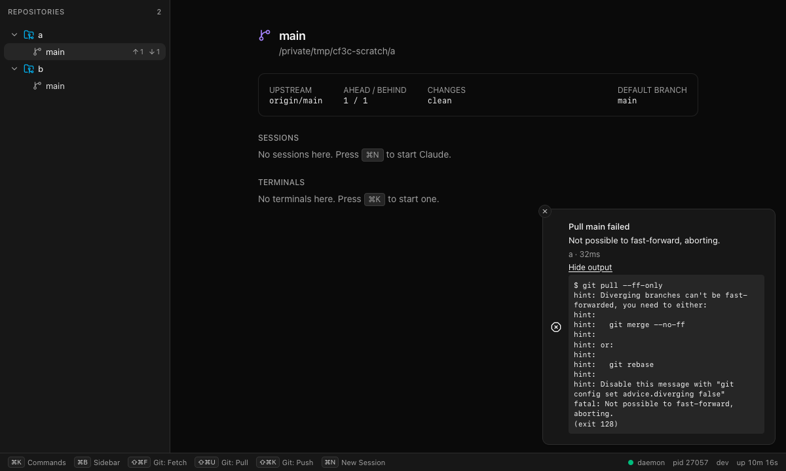

# Phase 3c: Git operations as registry commands

Status: done on branch. `make check` is green and `make gui-e2e` passes (54 tests: 27 per
browser, WebKit and Chromium, 5 of them new). Exercised end to end against the real
daemon:

* daemon + CLI: a fetch/pull/push round trip on scratch repos with a bare origin under
  /tmp, and `pr.create`/`pr.open` against GitHub (details below);
* daemon + GUI: the Vite app in headless WebKit against the same daemon, showing a fetch
  toast and a failed pull toast with its output expanded.



## What landed

| Path | What |
|---|---|
| `proto/codefoundry/v1/gitops.proto` | `GitOpsService` (Fetch, Pull, Push, CreatePullRequest, OpenPullRequest, OpenEditor, Reveal, OpenUrl, List, Watch), `GitOp`, `GitOpsEvent` |
| `proto/codefoundry/v1/events.proto` | Additive: `EVENT_SOURCE_GITOPS = 6`, `Event.gitops = 6` |
| `internal/store/gitops` | `Store` interface, `*Manager`, `Runner`/`ExecRunner`, per-worktree lanes, pure summarizers, editor resolution |
| `internal/store/gitops/gitopstest` | `Fake` store that publishes the same bus events |
| `internal/api/gitops.go` | Thin `GitOpsService` handler. Its mapping is shared with the events source |
| `internal/api/events.go` | `gitopsSource` adapter, plus `EventsDeps.GitOps` |
| `internal/command/commands_gitops.go` | `GitOpsBackend`, `GitOpsDeps`, and the 8 commands |
| `internal/command/commandtest/gitops.go` | Fake backend |
| `internal/command/all/all.go` | `Deps.GitOps` and one `RegisterGitOps` line |
| `internal/daemon/{stores,daemon}.go` | Store field, open/close, route, `EventsDeps.GitOps`, command deps |
| `gui/frontend/src/api/gitops.ts` | View models, `isGitOpResult`, `isGitOpFailure` |
| `gui/frontend/src/stores/gitops.tsx` | `planGitOpToasts` (pure) and `applyGitOpsEvent` (sonner side effects) |
| `gui/frontend/src/components/gitops/GitOpToast.tsx` | Toast bodies: progress, and result with expandable output |
| `gui/frontend/mock/gitops.ts` | Mock ops with per-worktree queueing; `/__mock/gitops` controls |
| `gui/frontend/e2e/gitops.spec.ts` | Toast flow e2e |

## Commands

| Command | Args | When | Chord |
|---|---|---|---|
| `git.fetch` | `worktree` | worktree | cmd+shift+f |
| `git.pull` | `worktree`, `rebase` | worktree | cmd+shift+u |
| `git.push` | `worktree`, `force-with-lease` | worktree | cmd+shift+k |
| `pr.create` | `worktree`, `title`, `body`, `draft`, `base` | worktree + GitHub slug | — |
| `pr.open` | `worktree` | worktree + GitHub slug | — |
| `worktree.open.editor` | `worktree` | worktree | cmd+shift+o |
| `worktree.reveal` | `worktree` | worktree | — |
| `view.open.url` | `url` (required) | always | — |

* `worktree` is a `Path` arg bound to `ContextWorktree`. "When: worktree" therefore means
  an active worktree *or* an explicit `--worktree`, through the registry's existing
  overlay. From the CLI: `code-foundry git push --worktree .`.
* The GitHub slug comes from `GitOpsDeps.GitHubSlug(ctx)`. The daemon wires it to
  `gitops.Manager.GitHubSlug(repoID, worktreePath)`, which reads the repo store snapshot.
  It matches the worktree first (exact path, else the longest containing worktree), then
  the repo id.
* **Result**: on success, `Message` is the op summary (plus the URL when there is one) and
  `JSON` is the `GitOp`. A failed op returns a `*connect.Error` (`unknown`) whose message
  is "`<title>` failed: `<summary>`" followed by the last 20 output lines, with the
  `GitOp` attached as an **error detail**. The CLI exits 1 and prints the output.
  Request errors (bad path, unavailable, bad args) keep their codes and exit 2.

## Store decisions

* **Lanes**: one FIFO per resolved worktree path. A lane goroutine drains its queue, and
  each job takes a slot from a global semaphore (4 workers). Different worktrees run in
  parallel, and two ops on one worktree never overlap. When an op has to wait behind an
  earlier op on its own lane, `Queued` is published. Waiting for a free worker is not
  reported.
* **Ops outlive their callers.** An op runs on the store's context, not the RPC's: an
  interrupted CLI or a closed palette does not half-cancel a push. The caller's ctx only
  bounds its wait (the RPC returns `canceled`/`deadline_exceeded`). `Close` (daemon
  shutdown) kills running ops ("cancelled: daemon is shutting down") and waits for the
  lanes to drain.
* **Timeouts per kind**:

  | Ops | Timeout |
  |---|---|
  | fetch, pull, push, PR create | 3m |
  | PR open | 1m |
  | editor | 20s |
  | reveal, open URL | 10s |

  A timed-out op fails with "timed out after N".
* **Process environment** (`ExecRunner`):
  * stdin is /dev/null and `Setsid` is set, so there is no controlling TTY.
  * `WaitDelay` is 2s. An exit-0 process whose grandchild still holds the pipes (an
    editor launcher) counts as success.
  * Inherited `GIT_DIR`/`GIT_WORK_TREE`/... are scrubbed.
  * Pinned variables: `GIT_TERMINAL_PROMPT=0`, `GIT_EDITOR=true`,
    `GIT_SEQUENCE_EDITOR=true`, `GIT_MERGE_AUTOEDIT=no`, `GIT_PAGER=cat`, `LC_ALL=C` (the
    summaries match English), `GH_PROMPT_DISABLED=1`, `GH_NO_UPDATE_NOTIFIER=1`,
    `GH_SPINNER_DISABLED=1`, `GH_PAGER=cat`, `NO_COLOR=1`, `CLICOLOR=0`.

  The repo store's runner is unexported, and 3c must not edit that package, so the
  scrub list is duplicated (8 names).
* **Transcript**: `Op.Output` is every command that ran, as `$ git push -u origin x`
  (shell-quoted for display), followed by its interleaved stdout/stderr and `(exit N)` on
  failure.
  * Read-only probes are not recorded: `symbolic-ref`, `rev-parse @{upstream}`,
    `remote get-url`, and rebase-state checks. On success they would show `fatal:` lines.
  * CRs are normalized to newlines.
  * The output is capped at 64 KiB; the tail is kept.
* **Summaries** are pure functions with table tests (`summary.go`):
  * fetch: "fetched N updated refs, pruned M"
  * pull: "already up to date", "fast-forwarded: `<shortstat>`", or "rebased …"
  * push: "pushed X to origin (new branch)" or "force-pushed …"
  * failure: the `! [rejected]` line, else `fatal:`, else `error:`, else the last
    non-hint line
* **Branch in titles**: `resolve` runs `git symbolic-ref` when the op is requested,
  because the repo snapshot can trail a `git switch`. If that fails, it uses the
  snapshot's branch, then the directory name. Editor and reveal ops are titled by the
  worktree directory name.
* **Refresh**: after fetch, pull, push and PR create, `repo.Store.Refresh(repoID)` runs
  in the background (30s timeout). Errors are logged.
* **Snapshot/events**: an `atomic.Pointer[Snapshot]` holds active ops (oldest first),
  then the last 20 finished (newest first). It is rebuilt and published under one mutex,
  as in the repo store. One bus topic, `gitops.Event{Type: Queued|Started|Finished, Op}`.
  The Watch/EventService buffer is 64; on drop a fresh snapshot is sent.

### Operations

* **fetch**: `git fetch --prune` (the default remote).
* **pull**: `git pull --ff-only`, or `--rebase`. If a rebase stops (rebase-merge or
  rebase-apply exists after the failure), the store runs `git rebase --abort` and fails
  with "rebase stopped on conflicts and was aborted; the worktree is unchanged". Agents
  work in these worktrees, so a half-done rebase is never left behind.
* **push**:
  * Detached HEAD fails.
  * Without an upstream, it runs `git push [-u] [--force-with-lease] origin <branch>`
    (failing if there is no `origin`). This matches repo.CreateWorktree's `--no-track`
    branches.
  * With an upstream, it runs plain `git push [--force-with-lease]`, and the summary
    names the upstream's remote.
* **pr.create**:
  1. Takes the branch.
  2. If no title was given, uses `git log -1 --format=%s`.
  3. Pushes (as above, no force).
  4. Runs `gh pr create --head <branch> --title T --body B [--draft] [--base X] --repo <slug>`.
     `--repo` is omitted when the slug is unknown, and gh resolves the repo itself.
  * The URL comes from stdout.
  * "already exists" with a URL counts as success ("pull request #N already exists").
    The user wants a PR for the branch, and there is one.
  * gh is found with `gh.LookPath` (PATH, then Homebrew).
* **pr.open**: `gh pr view <branch> --json url,number --jq .url [--repo slug]`, then
  `open <url>`. The browser is opened with `open`, not `gh --web`, so the URL appears in
  the result.
* **editor**: `Options.Editor func() string` is read on every call, so a settings store
  can feed it live.
  * It holds shell-style words; `{path}` is substituted, otherwise the path is appended.
    Bare names are looked up on PATH plus `/opt/homebrew/bin` and `/usr/local/bin`,
    because an app-launched daemon has launchd's PATH.
  * Empty means detect, in this order:
    1. `$VISUAL`/`$EDITOR`, only when its basename is a GUI editor (code, cursor, zed,
       subl, …). `nvim` with no TTY would hang or exit.
    2. `cursor`, `code`, `zed`, `subl`, `windsurf` on PATH.
    3. An app bundle in /Applications, via `open -a`.
    4. Otherwise the op fails with "no editor found: set the editor command".
  * A malformed setting is `invalid_argument`.
  * **Interim**: the daemon passes `os.Getenv("CODE_FOUNDRY_EDITOR")` until 3b's settings
    exist.
* **reveal**: `open -R <path>`.
* **open URL**: only absolute `http(s)` URLs with a host. `file:`, `javascript:` and
  bare hosts are `invalid_argument`, because `open` would launch anything.

## GUI

* The events stream carries a new `gitops` source: `toEventView` maps it, and the
  `handlers` registry routes it to `applyGitOpsEvent`. There is no zustand slice: toasts
  are the only consumer.
* `planGitOpToasts(shown, event)` (pure, vitest) decides what to show:
  * queued or started: a progress toast (`toast.loading`, id = op id, sonner updates it
    in place). The second line is the worktree directory, plus "waiting for the previous
    operation" when the op is queued.
  * finished: a result toast with the same id. Ops started from the CLI get one too.
  * a snapshot (connect or resync): progress toasts for active ops. A result is shown
    only for ops whose progress toast is still up, so reconnecting does not replay old
    results.
* **Result toasts**:
  * Success: summary, worktree · duration, 5s. A created PR gets an **Open** action,
    which invokes `view.open.url`.
  * Failure: "`<title>` failed", summary, and a **Show output** toggle that reveals a
    scrollable `<pre>` with the transcript. It stays until closed (close button).
* **Duplicate suppression** (`stores/commands.ts`, two lines): `runCommand` skips its
  generic success toast when `result_json` parses as a `GitOp`. It skips its error toast
  when the `ConnectError` carries a `GitOp` detail. Errors where the op never ran
  (unavailable, bad args) still use the generic toast.
* **Gotcha**: sonner measures a toast's height when its props change, not when a child's
  state changes. The first version kept "expanded" in component state, and the output
  spilled out of the toast (caught in the live screenshot). The toggle now re-issues the
  toast with `expanded` flipped.
* The footer already lists the new chords (Git: Fetch, Pull, Push) via the registry.

### Mock and e2e

* `mock/gitops.ts` provides:
  * the same 8 commands
  * per-worktree promise lanes (queued events)
  * invoke resolving at the end of the op: `result_json` = GitOp on success, and on
    failure a `ConnectError` with a GitOp detail
* Controls: `POST /__mock/gitops?fail=git.push&delay=800` and `GET /__mock/gitops`.
* `world.invoke` now overlays an explicit `worktree` arg onto the context for `when`, as
  the daemon does.
* e2e cases (both browsers):
  * push via cmd+shift+k: running toast, then succeeded, with exactly one toast for the
    summary
  * failed push via the palette: output expands, there is no generic toast, and the toast
    is still up after 5.5s
  * fetch then pull on one worktree: the pull shows "waiting…", then its result
  * a CLI-style Invoke over Connect JSON gets a toast
  * pr.create is absent on a slug-less repo; on a GitHub repo its Open action invokes
    `view.open.url` with the PR URL

## Live verification (real daemon, CLI)

Scratch repos: `/tmp/cf3c-scratch/{origin.git (bare), a, b}`, daemon on
`CODE_FOUNDRY_HOME=/tmp/cf3c-home`.

```
a: git.push on new branch feat     -> pushed feat to origin (new branch); feat@{upstream} = origin/feat
a: git.push again                  -> already up to date
b: git.fetch                       -> fetched 1 updated ref
a: commit+push main; b: git.pull   -> fast-forwarded: 1 file changed, 1 insertion(+)   (HEADs equal)
diverge (conflicting README edits):
b: git.pull                        -> exit 1: Pull main failed: Not possible to fast-forward, aborting.
b: git.push                        -> exit 1: Push main failed: [rejected] main -> main (non-fast-forward)
b: git.pull --rebase               -> exit 1: ... rebase stopped on conflicts and was aborted; the worktree is unchanged
                                      (HEAD unchanged, status clean)
b: git.push --force-with-lease     -> force-pushed main to origin  (--json shows the GitOp, durationMs 50)
a: git.fetch after origin feat deleted -> fetched 1 updated ref, pruned 1
pr.create on a repo without slug   -> exit 2: not available in this context
git.fetch --worktree /nope         -> exit 2: invalid argument: worktree path: lstat ...: no such file or directory
view.open.url file:///etc/passwd   -> exit 2: invalid argument: "file:///etc/passwd" is not an http(s) URL
```

Concurrency, decoded from `EventService.Watch` (gitops source) while running
`fetch a & pull a & fetch b`:

```
snapshot 10 ops
started   op-11  Fetch main  (b)
started   op-12  Pull main   (a)
queued    op-13  Fetch main  (a)      <- behind the pull on the same worktree
finished  op-12  Pull main   FAILED   Not possible to fast-forward, aborting.
started   op-13  Fetch main  (a)
finished  op-11  Fetch main  SUCCEEDED already up to date
finished  op-13  Fetch main  SUCCEEDED already up to date
```

**pr.create / pr.open, live on GitHub.** The target was Alex's own dormant private repo
`alexwaumann/quest-board` (ADMIN; no workflows; no PRs before this test), on a throwaway
branch `cf3c/pr-create-test` in a scratch clone at /tmp. This repository was not used.

```
pr.create --draft --body ...   -> created draft pull request #1  https://github.com/alexwaumann/quest-board/pull/1
                                  transcript: git log -1 --format=%s; push -u origin cf3c/pr-create-test; gh pr create ... --draft --repo alexwaumann/quest-board
pr.create again                -> pull request #1 already exists: https://github.com/alexwaumann/quest-board/pull/1
pr.open                        -> opened pull request #1 (opened in the browser)
gh pr view                     -> {"isDraft":true,"state":"OPEN","title":"test: code-foundry pr.create live check (throwaway)","baseRefName":"main"}
cleanup                        -> gh pr close --delete-branch (PR #1 closed, branch deleted; remote branches: main only)
```

Editor, Finder, browser (daemon started with
`CODE_FOUNDRY_EDITOR="/usr/bin/open -a Finder"`, because no editor is installed on this
machine):

* `worktree open editor` → "opened a in Finder"
* `worktree reveal` → "revealed /private/tmp/cf3c-scratch/b in Finder"
* `view open url https://example.com/?from=code-foundry-3c` → opened

Auto-detection was not exercised live: there is no cursor/code/zed here and `$EDITOR`
is nvim. It is covered by table tests.

## Deviations

* **Command names**: `worktree.open_editor` and `view.open_url` don't match the
  registry's `NamePattern` (no underscores), so they are `worktree.open.editor` and
  `view.open.url`. The CLI forms are `worktree open editor` and `view open url`.
* **pr.create pushes first** (with upstream). Without that, `gh pr create` in
  non-interactive mode fails for an unpushed branch.
* **"already exists" counts as success** for pr.create.
* **Queued events** were added next to Started/Finished, so the GUI can say "waiting".
* **Interim `CODE_FOUNDRY_EDITOR`** env var (see Editor).
* **Per-RPC response messages**: buf lint's `RPC_REQUEST_RESPONSE_UNIQUE` forbids sharing
  one `GitOpResponse`, so each RPC has its own response, each wrapping `GitOp op = 1`.

## Merge notes

* `events.proto`: `EVENT_SOURCE_GITOPS = 6` / `Event.gitops = 6`. If 3b or 3d also add a
  source, renumber one side; buf fails loudly on a clash. Run `make gen` after resolving.
* `internal/api/events.go`: the additions are one `EventsDeps.GitOps` field, one `if` in
  `sources()` (after gh, before ui), and the `gitopsSource` block. `events_test.go`
  changes: the fixture field, `describe` case, snapshot row `gitops.snapshot(1)`, a live
  push started/finished pair, and a filter row.
* `internal/command/all/all.go`: `Deps.GitOps command.GitOpsDeps` plus
  `command.RegisterGitOps(r, d.GitOps)`.
* `commands_test.go`: 8 names appended to `TestAllRegistersEveryDomain`.
* New chords: cmd+shift+f/u/k/o. None is reserved, and the registry test enforces
  uniqueness after merge.
* `internal/daemon/stores.go`: field, `gitops.New(...)` after `startGh`, and `Close`
  before `stopGh`/repo.
* `internal/daemon/daemon.go`: `gitopsAPI`, `Deps.GitOps`, the route, and
  `EventsDeps.GitOps`.
* **3b (settings)**: replace the `Editor:` func in `stores.go` with the settings value,
  e.g. `func() string { return settings.Snapshot().Editor }`. It is read on every open.
  Suggested default: "" (detect), with help text naming `{path}`.
* **3b (confirm flag)**: `git.push --force-with-lease` is the only destructive one; 3b
  may want to mark it.
* **3a (overview page)**: buttons there can call `runCommand("git.fetch", …)` etc. Toasts
  come for free.
* GUI: `stores/events.ts` has one handler entry and one import. `api/events.ts` has one
  union member and one case. `stores/commands.ts` has two guarded toast lines.
  `mock/server.ts` and `mock/world.ts` have small additive edits; the bulk is in
  `mock/gitops.ts`.

## Gotchas

* macOS has no `timeout(1)`; scripts that wrap `buf curl` need another way to stop it.
* `git pull --rebase` prints `Rebasing (1/1)\r`. Without CR normalization the GUI showed
  one run-on line.
* The live check ran `pkill -f "code-foundry daemon --dev"` once to stop the scratch
  daemon. That pattern would also match other worktrees' dev daemons that were running at
  the time. Kill by PID instead.
